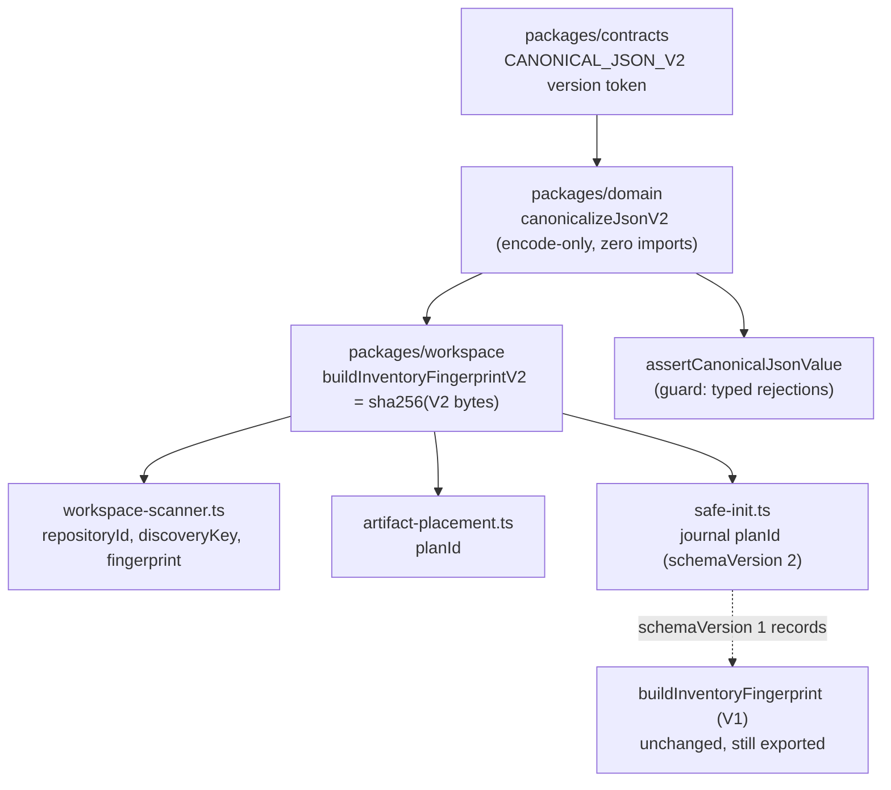

# Canonical JSON — T3 slice design

**Spec**: `.specs/features/canonical-json/spec.md`
**Status**: Draft

---

## Architecture Overview

A pure, import-free RFC 8785 encoder lives in `packages/domain`. Because the
architecture rule bars `node:crypto` from domain, hashing stays in
`packages/workspace`, which already depends on `@verchestra/domain`. The
resulting split is a clean seam: domain owns *bytes*, the adapter owns *digests*.



The V1 function is not deleted, not wrapped, and not re-pointed. It stays
byte-identical so an existing `schemaVersion: 1` journal keeps verifying.

---

## The two byte-contract differences that matter

V1 (`scanner-primitives.ts:104-119`) is not merely "JCS with a locale bug". It
differs from JCS in two independent ways, and both must be handled deliberately:

| Aspect | V1 behaviour | V2 (RFC 8785) | Consequence |
| --- | --- | --- | --- |
| Object member order | `left.localeCompare(right)` (line 111) | UTF-16 code-unit order | Locale-dependent bytes; the headline defect in #58. |
| Array order | **sorted** by `JSON.stringify(x).localeCompare(...)` (line 106) | **preserved** | V1 silently treats every array as a set. Any caller relying on that must now normalize explicitly, or its identity changes meaning, not just its bytes. |

The array difference is the higher risk of the two and the reason this slice
needs explicit set normalization (CJ-05) rather than a drop-in swap.

---

## Versioning strategy

Compatibility-matrix row 1 applies to the journal ("has an explicit
schema/version → keep its V1 bytes and verifier; add a new schema/version for V2
output"), so the journal envelope's existing `schemaVersion` is bumped 1 → 2
rather than gaining a parallel `canonicalizationVersion` field.

Identities additionally become **self-describing** at the string level:

| Version | Emitted form |
| --- | --- |
| V1 | `sha256:<hex>` |
| V2 | `v2:sha256:<hex>` |

This makes a mixed-version comparison a visible inequality rather than a silent
false negative, and lets a reader select its verifier from the value itself
without consulting a sibling field.

**Fail-closed rule:** a journal declaring `schemaVersion: 2` whose `planId` does
not carry the `v2:` prefix, or a `schemaVersion: 1` journal whose `planId` does,
is rejected as invalid — never re-verified under the other version.

---

## Code Reuse Analysis

### Existing components to leverage

| Component | Location | How to use |
| --- | --- | --- |
| V1 validation semantics | `packages/evidence/src/integrity/canonical.ts:31-105` | Port the *rules* (surrogate pairing, depth 128, 100k nodes, accessor/symbol/sparse rejection) into the domain guard. Do **not** import — evidence is an adapter and the inward rule forbids it. |
| `IntegrityError` code shape | `packages/evidence/src/integrity/canonical.ts:8-26` | Mirror the typed-code pattern with domain-local `VES_CANONICAL_*` codes. |
| `WorkspaceScanError` | `packages/workspace/src/scanner/scanner-primitives.ts` | Reuse for workspace-side rejection so error surfaces stay unchanged. |
| Existing test style | `tests/unit/artifact-placement.test.mjs` | `node:test` + `node:assert/strict`, importing through `packages/*/src/index.ts`. |
| Boundary rule engine | `scripts/architecture.mjs:56-75` | Assert the new domain module against `inspectSource` directly. |

### Integration points

| System | Integration method |
| --- | --- |
| `packages/workspace` → `packages/domain` | Dependency already declared in `packages/workspace/package.json`; no new package edge. |
| `gate:security` | Already runs `test:unit`, `test:architecture`, `test:security`, `test:fault` — every layer this slice adds. |

---

## Components

### `CANONICAL_JSON_V2` contract token

- **Purpose**: Name and version the canonicalization contract so records can cite it.
- **Location**: `packages/contracts/src/canonical-json.ts`
- **Interfaces**:
  - `CANONICAL_JSON_V2: "v2"` — the version token embedded in digest prefixes
  - `type CanonicalJsonVersion = "v1" | "v2"`
  - `parseCanonicalJsonVersion(identity: string): CanonicalJsonVersion` — derives the version from a self-describing identity string
- **Dependencies**: none
- **Reuses**: existing contracts export barrel

### `canonicalizeJsonV2` encoder

- **Purpose**: Encode a validated JSON value to RFC 8785 bytes.
- **Location**: `packages/domain/src/canonical/canonical-json.ts`
- **Interfaces**:
  - `canonicalizeJsonV2(value: unknown): string`
- **Dependencies**: none — zero third-party imports, zero `node:` imports (CJ-02)
- **Reuses**: `JSON.stringify` for primitive emission (assumption A2); default `Array.prototype.sort()` for code-unit member ordering (assumption A1)
- **Note**: arrays are emitted in their given order; the encoder never sorts them.

### `assertCanonicalJsonValue` guard

- **Purpose**: Reject anything RFC 8785 cannot faithfully represent, before encoding.
- **Location**: `packages/domain/src/canonical/canonical-guard.ts`
- **Interfaces**:
  - `assertCanonicalJsonValue(value: unknown): asserts value is JsonValue`
  - `class CanonicalJsonError extends Error { readonly code: CanonicalJsonErrorCode }`
- **Dependencies**: none
- **Reuses**: rule set ported from `packages/evidence/src/integrity/canonical.ts:31-105`

### `normalizeDeclaredSet` helper

- **Purpose**: Let a domain declare that a collection is a set, ordering it by code unit before encoding — replacing V1's implicit array sort.
- **Location**: `packages/domain/src/canonical/canonical-sets.ts`
- **Interfaces**:
  - `normalizeDeclaredSet<T>(items: readonly T[], key: (item: T) => string): readonly T[]`
- **Dependencies**: none
- **Reuses**: default `sort()` for code-unit ordering

### `buildInventoryFingerprintV2`

- **Purpose**: Produce a `v2:sha256:` workspace identity from V2 bytes.
- **Location**: `packages/workspace/src/scanner/scanner-primitives.ts` (add alongside V1)
- **Interfaces**:
  - `buildInventoryFingerprintV2(value: unknown): string`
- **Dependencies**: `node:crypto`, `@verchestra/domain`
- **Reuses**: existing `WorkspaceScanError` codes

---

## Data Models

```typescript
// packages/workspace/src/init/safe-init.ts — journal envelope
interface RecoveryJournalV1 {
  readonly schemaVersion: 1
  readonly planId: `sha256:${string}`      // V1 bytes, still verified with V1
  readonly changes: readonly JournalChange[]
}

interface RecoveryJournalV2 {
  readonly schemaVersion: 2
  readonly planId: `v2:sha256:${string}`   // V2 bytes
  readonly changes: readonly JournalChange[]
}

type RecoveryJournal = RecoveryJournalV1 | RecoveryJournalV2
```

**Relationships**: the reader discriminates on `schemaVersion`, then asserts the
`planId` prefix agrees with it. Disagreement is a hard rejection (CJ-10).

---

## Error Handling Strategy

| Error scenario | Handling | Caller impact |
| --- | --- | --- |
| Non-finite number, `undefined` value, sparse array, accessor, symbol key, cycle | `CanonicalJsonError` with a specific `VES_CANONICAL_*` code | Same fail-closed behaviour as V1's `VES_WORKSPACE_INVENTORY_INVALID`; message text differs |
| Depth > 128 or nodes > 100 000 | `CanonicalJsonError("VES_CANONICAL_RESOURCE_LIMIT")` | Bounded work; no unbounded recursion |
| Unpaired surrogate in a key or string | `CanonicalJsonError("VES_CANONICAL_INVALID_UNICODE")` | Rejected before hashing |
| Journal `schemaVersion` disagrees with `planId` prefix | `recoveryConflict("Interrupted init journal is invalid")` | Recovery refuses to proceed; existing conflict path reused |
| `schemaVersion: 1` journal with a V1 digest mismatch | Existing `journal plan digest mismatch` error, unchanged | V1 behaviour preserved exactly (CJ-08) |

---

## Risks & Concerns

| Concern | Location | Impact | Mitigation |
| --- | --- | --- | --- |
| V1 sorts arrays; V2 preserves order. A drop-in swap changes identity *meaning*, not just bytes, wherever a caller passed an unsorted array. | `packages/workspace/src/scanner/scanner-primitives.ts:106` | Two logically equal inventories could stop matching, or two different ones could start matching. | T6 introduces `normalizeDeclaredSet`; T7/T8 migrate each call site by explicitly deciding set-vs-sequence per collection rather than migrating wholesale. |
| The T2 matrix records a blocker that is factually incomplete — it omits the architecture rule that actually prevents the prescribed placement. | `docs/canonical-json-compatibility.md:20-24, 78-82` | Future slices (T4) would hit the same wall and re-derive it. | T12 corrects the matrix and records the encoder decision in it. |
| `tests/mutation/` is executed by no declared test script; it appears only in `scripts/gate-selection.mjs:36`. The existing `verification-sensor.test.mjs` therefore never runs in a gate. | `scripts/gate-stages.mjs` (absent), `tests/mutation/` | A discrimination sensor placed there would be decorative — it could not fail a gate. | T11 places the sensor in `tests/security/`, which `test:security` runs and `gate:security` includes. The dormant `tests/mutation/` directory is flagged for a separate issue, not fixed here. |
| `test:architecture` is in `gate:build`/`gate:security` but **not** `gate:quick` or `gate:full`. | `scripts/gate-stages.mjs:2-12` | A task touching architecture that gates only on quick/full would not actually verify the boundary. | T2 and T4 gate on `build`; the final task gates on `security`. |
| Locale-dependent sorts also exist in this slice's *consumers*, feeding digest input ordering. | `safe-init.ts:87,188,256`; `workspace-scanner.ts:265,290,292,293`; `artifact-placement.ts:270` | Migrating only the encoder would leave ambient collation determining input order — the defect would survive one level up. | T7/T8 replace these with code-unit ordering in the same tasks that migrate their identities. |
| `packages/evidence`'s V1 primitive stays on `canonicalize@3.0.0` while domain gets an independent encoder — two RFC 8785 implementations coexist. | `packages/evidence/src/integrity/canonical.ts:3` | Divergence risk if one is fixed and the other is not. | Accepted and bounded for this slice: T2's vector suite pins domain to the published vectors, so both are anchored to the same external specification rather than to each other. Consolidation belongs to the evidence slice in T4. |

---

## Tech Decisions

| Decision | Choice | Rationale |
| --- | --- | --- |
| Encoder placement | Internal RFC 8785 encoder in `packages/domain`, zero imports | `scripts/architecture.mjs:67-69` bars third-party imports in domain. Writing the encoder avoids widening an architecture control, and in JS the risky part of JCS (number serialization) is delegated to `JSON.stringify` (A2). Owner decision, 2026-08-01. |
| Hashing placement | `packages/workspace`, not domain | `node:crypto` is barred from domain (`VES_ARCH_DOMAIN_NODE_IMPORT`). Domain owns bytes; the adapter owns digests. |
| Version discrimination | Journal `schemaVersion` 1→2 **and** a `v2:` identity prefix | Matrix row 1 prescribes a schema bump for versioned records; the prefix additionally makes mixed comparison visibly unequal instead of silently false. |
| V1 disposition | Left byte-identical and still exported | CJ-08. Replacing it would invalidate every existing `schemaVersion: 1` journal. |
| Sensor location | `tests/security/`, not `tests/mutation/` | `tests/mutation/` runs in no declared gate (A4). A sensor that cannot fail a gate does not discriminate. |

> **Project-level decision:** the encoder-placement choice sets a precedent for
> every later slice in #58 (T4). Append it to `.specs/STATE.md` `## Decisions`
> as `AD-009` in T13.
