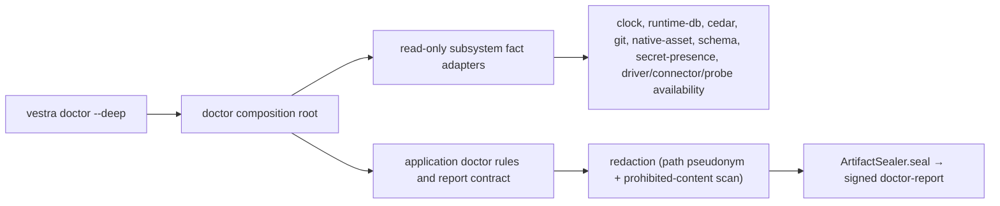

# T72 Deep Doctor and Signed Diagnostic Reports Design

**Spec**: `.specs/features/deep-doctor/spec.md`
**Status**: Drafted for implementation

## Architecture

T72 follows the AD-010 three-region split established for Self-Test. Pure
verdicts and the closed report contract live in application; read-only
subsystem observations live in the Node-bound adapter; the CLI composition root
alone constructs the read-only fact adapters and the TEST-ONLY signing identity.
The report seals with the existing `ArtifactSealer`/`NodeEd25519Signer` and is
redacted with the existing support-bundle toolkit — no new crypto, no new
redaction engine.



## Components

### Application doctor rules and contract

- **Location**: `packages/application/src/doctor/doctor.ts` (new)
- Owns the closed `DOCTOR_CHECK_IDS` catalog and the closed
  `DOCTOR_REPORT_FIELDS` allowlist (`doctor.*`), mirroring
  `SELF_TEST_REPORT_FIELDS`.
- Accepts `DoctorCheckFact[]` from the ports and produces the verdict: rejects
  a missing/duplicate/unknown check id, a fact that carries a raw error/secret/
  path, or a blocked check without a registered remediation code.
- Owns `buildDoctorReport(facts)` → `DoctorReportPayload` and the exit-code
  mapping (`pass → 0`, `check-failed → distinct`, `blocked → distinct`,
  `internal → distinct`).
- Owns `assertDoctorReportPayload` (allowlist + prohibited-content class check,
  reusing the same `PROHIBITED_FIELD_CLASS` shape as self-test).
- Never touches the filesystem, a process, a clock, or a socket.

### Read-only subsystem fact adapters

- **Location**: `packages/self-test/src/doctor-facts.ts` (new; sibling of the
  existing Self-Test facts, same no-sibling-adapter-import rule).
- One observer per subsystem, each returning a `DoctorCheckFact`
  `{ checkId, status: "pass"|"fail"|"blocked", capabilityId, remediationCode? }`
  and never a verdict, secret, raw error, or absolute path:
  - `installation` — the installed manifest resolves and declares a version.
  - `contract-schema` — `SchemaRegistry.load` compiles every `schemas/*` and the
    `doctor-report` schema is registered.
  - `cedar-policy` — a policy view digest is observable, or `blocked` if no
    bundle is present.
  - `sqlite-durable-state` — `inspectRuntimeDatabase` opens the runtime store
    read-only and reports integrity, or `blocked` if absent.
  - `native-asset` — the hermetic bundle native asset is present and its digest
    matches, or `blocked`.
  - `git` — a real `git --version` / repository probe is read-only, or `blocked`.
  - `secret-presence` — the secret broker reports whether a required secret is
    present, exposing only presence (boolean), never a value.
  - `clock` — `SystemClock` returns a monotonic, plausible instant.
  - `driver` / `connector` / `probe` — availability codes from the read-only
    availability surfaces (no invocation, no network, no paid call).
  - `sandbox` — the protected-path/sandbox broker reports it is enforcing.
- Absent fixtures yield `blocked` with a remediation code; a read-only adapter
  that reports it is NOT read-only yields `fail`.

### CLI composition root

- **Location**: `apps/vestra-cli/src/doctor-composition.ts` (new)
- `runDoctorDeep({ controlRoot })`: captures sentinels before, runs every
  registered fact observer against read-only adapters, asserts sentinel
  invariance after, redacts (pseudonymize paths, `ProhibitedContentScanner`),
  builds the payload through the application rule, and seals it with a per-run
  `NodeEd25519Signer.generate({ keyId: "doctor-cli", purposes: ["doctor-report"] })`
  wrapped in `ArtifactSealer`. The signing key is never persisted or printed.
- Mirrors `self-test-composition.ts:186-206`; the signing identity is composed
  here so it is unreachable from anything a check observes.

### CLI verb and dispatch

- **Location**: `apps/vestra-cli/src/release-manifest.ts`,
  `apps/vestra-cli/src/main.ts`.
- Add a frozen `doctor` command: `{ name:"doctor", summary, supportsJson:true,
  mutating:false, options:[{ name:"deep", kind:"boolean" }] }`.
- Add an `executeDoctor` function and a dispatch branch in `main.ts` (`command.name
  === "doctor" ? executeDoctor(command) : …`), read-only, never through the
  mutating `createCommandBus`. Human/JSON rendering and exit codes reuse the
  existing `cli.ts` renderers and `exitCode`.

### Diagnostic report schema

- **Location**: `schemas/doctor-report/1.schema.json` (new, hand-written,
  `$id: "ves://doctor-report/1"`, `additionalProperties:false`), regenerated
  into `packages/contracts/src/generated.ts` via
  `scripts/generate-contract-types.mjs`. A contract test validates a passing and
  a failing example and rejects unknown fields, prohibited content, and bad
  verdicts.

## Data contracts

```typescript
type DoctorCheckStatus = "pass" | "fail" | "blocked";

interface DoctorCheckFact {
  readonly checkId: string;         // member of DOCTOR_CHECK_IDS
  readonly status: DoctorCheckStatus;
  readonly capabilityId: string;    // the capability this check gates
  readonly remediationCode?: string; // required when status !== "pass"
}

interface DoctorReportPayload {
  readonly "doctor.verdict": "PASS" | "FAIL" | "BLOCKED";
  readonly "doctor.check_codes": readonly string[];   // checkId:status, sorted
  readonly "doctor.failure_codes": readonly string[]; // stable codes only
  readonly "doctor.blocked_capabilities": readonly string[];
  readonly "doctor.remediation_codes": readonly string[];
  readonly "doctor.duration_ms": number;
}
```

## Failure strategy

| Failure | Outcome |
| --- | --- |
| Missing, duplicate, or unknown check id | Fail closed before sealing (`VES_DOCTOR_CHECK_CATALOG_INVALID`) |
| Blocked check without a remediation code | Fail closed (`VES_DOCTOR_REMEDIATION_MISSING`) |
| Fact carries a secret, raw path, or DB content | `ProhibitedContentScanner` rejects before sealing |
| Read-only adapter reports it is not read-only | The check is `fail` with a stable code |
| Sentinel mutated during the run | Fail closed (`VES_DOCTOR_SENTINEL_MUTATION`) |
| Absent subsystem fixture | `blocked` + remediation, never an exception |

## Dependency policy

Only existing workspace packages enter the CLI import graph. No third-party
package or version change is in scope; signing and redaction reuse
`@verchestra/evidence`.
