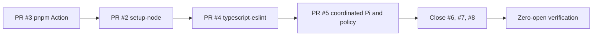

# Dependency Pull Request Backlog Design

**Spec**: `.specs/features/dependency-pr-backlog/spec.md`  
**Status**: Approved

## Approach

Use each compatible Dependabot PR as the integration surface when its branch is
writable. The Pi pair is intentionally consolidated in PR #5 because merging
either package alone leaves duplicate versions and invalidates the exact T02
identity. GitHub remains the authority for PR state and checks; tracked
specification and handoff files preserve resumable evidence.

## Delivery Sequence

## Integration Rules

| Surface | Decision |
| --- | --- |
| GitHub Actions | Pin exact official release commits and keep inline versions accurate. |
| Pi packages | Upgrade both packages together and update exact qualification evidence. |
| Dependabot | Group Pi packages; ignore only incompatible major update classes. |
| Merge | Squash only, sequentially, after PR checks and post-merge `main` checks. |
| Lighthouse | Preserve 0.95; diagnose reproducible failure instead of changing policy. |

## Risks and Mitigations

| Risk | Impact | Mitigation |
| --- | --- | --- |
| Stale branches omit newer workflow files | Inconsistent action versions | Refresh from `main` and search all workflow occurrences before commit. |
| Split Pi upgrades install two versions | Invalid qualification and larger lockfile | Consolidate in PR #5 and assert one 0.82.1 lockfile entry. |
| Lighthouse variance | False red CI | Allow one evidenced rerun; stop after two clean consecutive failures. |
| Dependabot overwrites maintainer work | Lost corrections | Push once after refresh; use a replacement maintainer PR if rejected. |
| Major dependency conflicts with exact runtime | Silent qualification drift | Close #6/#8 and encode scoped ignore rules. |

## No Public Interface Change

No product API, schema, website route, version, or roadmap state changes. The
only externally observable changes are dependency pins, workflow runner
versions, qualification evidence, and pull-request disposition.
