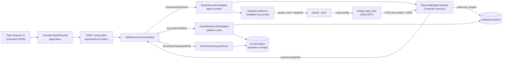

# Governed Task CLI Foundations Design (#405)

## Scope

This slice builds the ports and adapters a later composition (E6–E9) wires into
`vestra task`. It adds no CLI command and changes no existing caller's
behavior. Package placement follows `scripts/architecture.mjs`: portable rules
in `application`, Node effects in `platform-node`, the tool bridge and driver
adapter in `agent-runtime`, the Claude Code profile in `drivers`. No adapter
imports a sibling adapter; the composition root joins them.

## E1 — Task Request v1

`schemas/task-request/1.schema.json` is the canonical contract; the generator
emits `TaskRequest` into `packages/contracts/src/generated.ts`.
`packages/application/src/execution/task-request.ts` exports
`normalizeTaskRequest(value)` and `canonicalTaskRequest(value)`:

- `task` is delegated to `normalizeTask`, so requirement-ID and logical-path
  rules have one owner.
- `gates` are converted into a gate plan and passed through
  `canonicalTaskGatePlan`; coverage of `verificationCommands` and requirement
  IDs is checked with the same rules `TaskGateCommitCoordinator` applies later,
  so a request that would fail at gate time fails at intake instead.
- Gate `args` must not be absolute (`/`, `\`, drive letters) or contain a `..`
  segment. `commandRef` is resolved by the local allowlist
  (`NodeGateProcessRunner`), never by the request.
- Budgets reuse `DeclaredBudgets` with upper bounds: cost ≤ 1000 USD, tokens an
  integer ≤ 100,000,000, duration an integer ≤ 86,400,000 ms.
- Models must appear in `modelPriceTable` for the matching provider family
  (`claude-*` for the driver, `gpt-*` for the verifier). An unpriced model is
  rejected at intake instead of at the first usage event.
- `instructions` are bounded text; control characters other than tab/newline
  and Unicode bidirectional overrides are rejected.

The request never carries workspace identity, run identity, digests, paths to
executables, credentials, or approval material; the CLI derives those.

## E2 — Execution checkpoints

Migration `012_execution_checkpoints` adds one table keyed by
`(kind, workspace_id, run_id, task_id, sequence)` with `kind ∈ {executor, gate,
repair}`, the canonical record JSON, and its SHA-256 digest. It has no foreign
key to `runs`: the executor's run identity is not required to exist in the
workflow table, and checkpoints must be writable before the run capsule exists.
The table joins the backup state digest.

`RuntimeStore.appendExecutionCheckpoint` and `latestExecutionCheckpoint` do the
transactional work (`BEGIN IMMEDIATE`) and digest verification;
`RuntimeCheckpointStore` (platform-node) validates shapes and exposes:

- `executorCheckpoints()` → `ExecutionCheckpointPort`. The executor supplies
  sequences; only `latest + 1` or an identical replay is accepted. The store
  work is synchronous inside the async call, so the executor's fire-and-forget
  budget checkpoint keeps call order.
- `gateCheckpoints()` → the gate coordinator's checkpoint port, exported from
  application as `TaskGateCheckpointPort`. Stages are restricted to
  `gate-failed`, `gates-passed`, `commit-uncertain`, `committed`, each with its
  exact field set. `load` returns `undefined` after `gate-failed` because a
  failed attempt is terminal for that attempt; `committed` is returned verbatim,
  which the coordinator rejects, so the composition must consult
  `inspectGate()` first.
- `repairState(workspaceId, runId, taskId)` → `loadState`/`saveState` for
  `runGateRepairLoop`.

## E3 — Node adapters

- `NodeGitContextSource` implements `ContextSourcePort` for the `repository`
  kind. It requires an exact `expectedRevision`, lists with
  `git ls-tree -r -z --long`, reads blobs with `git cat-file blob <oid>` (no
  textconv, filters, or worktree reads), keeps only mode `100644`/`100755`
  blobs, and fails closed when entries, files, bytes per file, or total bytes
  exceed their bound. Fragment IDs are deterministic
  (`fragment_<uuid-v4-shaped digest>`) and trust is `untrusted-data`.
- `NodeWorktreeToolAdapter` implements `ExecutionToolPort`. It resolves the
  worktree through `NodeGitWorktreeAdapter.resolvePath` (registered, real, not a
  link), walks every component with `lstat`, refuses links, non-directories,
  `.git`, and configured always-protected roots, then writes through a
  same-directory temporary file and `rename`, or unlinks. Idempotency uses the
  runtime store's effect intents and operation receipts: the idempotency key is
  derived from `(workspaceId, worktreeRef, requestId)`, and the stored
  canonical input digest binds the full request, so a reused `requestId` with a
  different request fails closed. Intents are inserted directly in `applying`
  so no generic effect dispatcher can claim them. An interrupted intent is
  reconciled by observing the target before re-applying.
- `NodeGitWorktreeAdapter` gains `resolvePath(worktreeRef)` and an opt-in
  `anchorTaskCommits` option. When enabled, `create` rejects run/task IDs that
  are not valid ref components before any effect, and `cleanup` anchors
  `refs/heads/vestra/<runId>/<taskId>` on the single verified task commit
  (parent = base, Verchestra trailers present) with a create-only
  `git update-ref`, then removes the worktree. Default callers are unchanged.

`ExecutionPayloadPort` (application) is the content-by-digest seam:
`payload:sha256:<hex>` references resolve to bytes that the tool adapter
re-hashes before use. Deletes carry the tombstone `payload:none`.

## E4 — Mediated MCP tool bridge

See AD-039 in `.specs/STATE.md` for the channel decision. The module
`packages/agent-runtime/src/execution/mcp-tool-bridge.ts` has three parts:

1. **Protocol** — tool definitions and bounded JSON-RPC 2.0 framing, shared by
   both sides.
2. **Relay** (`runMcpToolBridgeRelay`, entry `mcp-tool-bridge-main.ts`) — the
   child that Claude Code launches. It answers `initialize`/`ping`/`tools/list`
   locally, forwards `tools/call` to the controller, and holds no authority:
   it never touches the filesystem.
3. **Controller** (`McpToolBridgeController`) — runs in the Verchestra process.
   It owns the socket, authenticates the relay, confines read tools to the
   worktree ∩ read scope minus protected paths and `.git`, and turns
   `write_file`/`delete_file` into `control.invokeTool` requests carrying a
   payload reference. Executor denials return to the model as tool errors with
   their stable code; an approval failure is fatal and cancels the run.

`ClaudeCodeDriver` gains a `mediated-mcp` profile selected at construction.
It is qualified for Claude Code `2.1.282` and later within major 2, the build
whose `--help` was read to confirm every flag. The profile:

- requires an absolute executable and an execution-time `mediation` block
  (worktree `cwd`, bridge command and environment);
- creates a per-run `0700` directory with `home/` and `config/`, writes
  `config/mcp.json` (`0600`) naming only the `verchestra` server, and removes
  the directory after the child exits;
- passes `--bare` (no keychain, OAuth, hooks, or CLAUDE.md discovery),
  `--strict-mcp-config --mcp-config <file>`, `--tools ""`,
  `--allowedTools` with the five bridge tool names,
  `--permission-mode dontAsk`, `--permission-prompts none`, and never a bypass
  flag;
- builds the environment from an allowlist (`PATH`, `LANG`, `LC_ALL`,
  `LC_CTYPE`, `TZ`, `TMPDIR`) plus the isolated `HOME`/`CLAUDE_CONFIG_DIR`,
  traffic/updater opt-outs, and exactly `ANTHROPIC_API_KEY` from
  `resolveExecution`, which must also be listed in `sensitiveValues`;
- checks the `system/init` event: every advertised tool must be a bridge tool
  and the `verchestra` server must be connected, otherwise it fails closed.

The existing profile keeps its arguments, environment, and minimum version.

## E5 — Driver execution adapter

`DriverExecutionAdapter` (agent-runtime) implements `ExecutionDriverPort`
against a structural `DriverSessionPort` (the `Driver` shape), so
agent-runtime does not import `drivers`. Per execution it resolves the
worktree path, opens a bridge controller, asks an injected `createSession`
factory for the driver and start request (the composition builds a
`ClaudeCodeDriver` whose `resolveExecution` returns the mediation block and the
brokered credential), and runs it:

- `usage.updated` → `control.reportUsage({ model, inputTokens, outputTokens })`
  with the model from `model.resolved`;
- `session.started` → checkpoint `driver-started`; completion → checkpoint
  `driver-finished` with counts only;
- `tool.requested` whose name is not a bridge tool → violation: abort and throw
  `VES_DRIVER_TOOL_OUTSIDE_BRIDGE`;
- `error` events → `failed`, abort → `cancelled`;
- `cancel(worktreeRef)` aborts the matching execution.

## What the composition agent wires next (E6/E7)

| Port | Adapter from this slice | Composition input |
| --- | --- | --- |
| `ExecutionCheckpointPort` | `RuntimeCheckpointStore#executorCheckpoints()` | opened `RuntimeStore` |
| gate checkpoints | `RuntimeCheckpointStore#gateCheckpoints()` | same store |
| repair `loadState`/`saveState` | `RuntimeCheckpointStore#repairState(...)` | same store |
| `ExecutionWorktreePort` | `NodeGitWorktreeAdapter({ anchorTaskCommits: true })` | repository + worktrees roots |
| `ExecutionToolPort` | `NodeWorktreeToolAdapter` | worktree adapter, effect repository, payload store, workspaceId |
| `ExecutionDriverPort` | `DriverExecutionAdapter` | payload store, bridge launcher, `createSession` building `ClaudeCodeDriver({ profile: { kind: "mediated-mcp" } })` |
| repository context | `NodeGitContextSource` | repository root, source ID |
| request intake | `normalizeTaskRequest` | request file bytes |

Remaining for E6/E7: the authority port (`RuntimeAuthorityStore` + Cedar), the
coordination port, the context compiler binding (`contextDigest ===
contextManifestDigest`), the gate allowlist, cross-process cancel, the bundled
relay entry in the sealed launcher, and the Codex verifier.

## E6–E9 — Composition slice

### E6 — `TaskRunCoordinator` (application)

`packages/application/src/execution/task-run.ts` sequences the owners against
the workflow machine and nothing else. From `EXECUTION_AUTHORIZED` it applies
`START_IMPLEMENTATION` with the binding rebuilt from the current policy (a
changed binding returns the run to `AWAITING_EXECUTION_APPROVAL`). In
`IMPLEMENTING` it returns early when the task is already committed; otherwise
it runs `runGateRepairLoop`, whose attempt takes the executor's resumable
awaiting-gate result when one still describes the live worktree and runs the
executor only when not. After the commit it applies `START_VERIFICATION` and
calls verification, which moves the run to `HUMAN_REVIEW`, `REPAIRING`, or
`HUMAN_RESOLUTION_REQUIRED`. A cancelled run is released and aborted by the
requesting human; every other failure is released and failed by the
controller with its stable code. It never applies `APPROVE_HUMAN_REVIEW`.

### E7 — `apps/vestra-cli/src/task/`

| Module | Role |
| --- | --- |
| `task-command.ts` | The only module `main.ts` imports (dynamically); dispatch and public-error mapping. |
| `task-plan.ts` | Intake, source state, context compile, package seal, approval request, run creation. |
| `task-approve.ts`, `task-confirm.ts` | Binding check, typed-back confirmation, sealed approval, `GRANT_EXECUTION_APPROVAL`. |
| `task-policy.ts`, `task-authority.ts` | Cedar task policy view; approval, capability grant, and Cedar decisions for executor, gates, and review. |
| `task-run.ts`, `task-implementer.ts` | Prerequisites, writer lease, executor and gate ports, resume and crash recovery, cancel watch. |
| `task-verifier.ts`, `task-codex.ts` | Codex session, verdict parsing, evidence inspection, revert-implementation sensor. |
| `task-review.ts`, `task-surface.ts` | Review surface digest, human review, run capsule. |
| `task-status.ts` | Status and cancel. |
| `task-credentials.ts`, `task-signing.ts` | Secret broker reads; the Workspace evidence key and its pinned trust anchor. |
| `task-process-tree.ts` | The provider processes of a command: the terminator both provider drivers are given, which stops a whole process tree, and the answer to a hang-up or a termination request while a provider runs. |
| `task-run-record.ts` | The Run record: the layout of the run directory and the sealed or plain, validated read and write of every artifact in it. |
| `task-files.ts`, `task-plan-record.ts`, `task-evidence.ts`, `task-workflow.ts`, `task-workspace.ts`, `task-gates.ts`, `task-context.ts`, `task-git.ts` | The seal and atomic write, the plan record's shape, gate evidence, workflow persistence, Workspace layout, allowlist, context, git. |

Durable state is split by owner. The runtime store keeps the run, events,
approvals, grants, lease, executor/gate/repair checkpoints, and tool receipts.
The run directory `<workspaceState>/tasks/<runId>/` keeps the sealed plan
record, the context manifest, the Execution Package, gate evidence, attempt
records, the commit record, the verification report and its lessons, the
review record, and the capsule. Each of those is either content-addressed or
sealed by its own digest and fails closed when edited.

Five files in the run directory are plain markers and are **not** sealed:
`grant.json`, `active.json`, `worktree.json`, `cancel.json`, and
`outcome.json`. They are canonical JSON written atomically. Where a marker's
content is read (grant, worktree, outcome), a file that is not a bounded
regular file holding a JSON object is refused; an unreadable active marker
counts as no live process, and the cancel marker is only tested for existence.
An edit to a marker is not detected. What limits an edited marker is the owner
of the fact it names: the grant marker holds only a grant ID, and the grant itself is
in the runtime store and is re-proven on every tool effect; the worktree
marker holds a handle the worktree module validates before it removes
anything; the active and cancel markers only say whether a process drives the
run and whether it was asked to stop; the outcome marker is what `status`
prints as the last outcome. The grant marker is digested into the Run Capsule
as it is read. Sealing the five markers is tracked separately; it is not part
of this design. `task-run-record.ts` is the one module that knows this layout.

The task path keeps three state roots beside the Workspace layout: `tasks/`
(the run directories), `keys/` (the evidence key and its trust anchor), and
`verification/` (scratch checkouts, which are deleted recursively). None is
created when the Workspace is opened; each is created by its first write, so a
dry run creates none. `task-workspace.ts` names them and, on every command,
refuses one that exists and does not resolve strictly inside the Workspace
state root (`VES_STATE_ROOT_ESCAPE`). The check only reads.

Below those roots nothing is reached through a link. The directories there
are created by the task path itself, from a per-Run root
(`tasks/<runId>`, `verification/<runId>`) down, and are real. Before every
read and write the Run record checks each directory from the Run directory
down to the one that holds the artifact, and the verifier checks each
directory from its scratch root down to the checkout it is about to create or
delete; a link at one of them is refused with the same code,
`VES_STATE_ROOT_ESCAPE`, wherever it leads. `task-workspace.ts` defines that
check (`requireRealDirectories`) beside the roots. It only reads, and a
directory that does not exist yet passes. A link in the place of an artifact
is not an escape, because nothing is read or written through it: a reader
refuses it as it refuses anything that is not a bounded regular file
(`VES_TASK_STATE_UNREADABLE`), and a writer refuses it with the same reason
instead of replacing it. A cancel marker that is already present stands as
the request, so that refusal never stops a cancel. The package and capsule
stores keep their own refusal of a linked file.

Verification turns Codex's answer into claims the coordinator can check
without trusting it: the expected outcome is derived from the approved task,
the cited assertion lines must exist at the commit, and the mutation reverts
the named implementation file in a scratch worktree and must make the covering
gates fail, while the user's checkout digest stays the same.

The sealed release adds `bin/mcp-tool-bridge.mjs` beside the launchers and
loads Cedar through the `web` glue from `native/cedar-wasm.wasm`; a repository
checkout reads the installed package's identical bytes.
