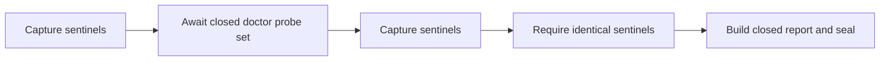

# Live Doctor Probes Design

## Flow

`DoctorSubsystemProbe` returns either a `DoctorObservation` or a promise of
one. `collectDoctorFacts` awaits probes in catalog order and converts a thrown
or rejected observation into the existing present-but-unhealthy fact. This
retains the T72 non-leak guarantee: error text is never copied into a fact.

## Live observation boundaries

| Check | Planned live boundary | Dependency condition |
| --- | --- | --- |
| sandbox | Protected-path broker rejects an out-of-root request before opening a file | Existing platform-node dependency |
| sqlite-durable-state | Dedicated defensive, read-only runtime inspection API | Existing platform-node dependency |
| secret-presence | Presence-only `SecretAdapter.has()` port; no `read()` surface | Existing platform-node dependency |
| driver | Pi manifest availability probe with an unreachable execution resolver | Existing drivers dependency |
| cedar-policy | Verify a policy bundle with pinned public identity | Requires direct policy dependency approval |
| connector | Connector availability surface without transport call | Requires direct connectors dependency approval |
| probe | Probe-worker availability surface without connection | Requires direct data-probe dependency approval |

The implementation must not substitute a path probe for a live observation.
If a dependency is not approved, that vertical remains blocked and #207 stays
open rather than reporting a fictional pass.

`DoctorLiveProbeOptions` is supplied only by a caller that has already resolved
the active Workspace. It accepts a runtime database reference and a
presence-only secret adapter; it never accepts a secret value or copies a path
or adapter result into a doctor report. Omitted live options produce `blocked`,
so a source checkout cannot claim provisioned-machine readiness.

## Failure behavior

- Missing provisioned state: `blocked` using the existing remediation mapping.
- A live observer that throws, rejects, is malformed, or reports unhealthy:
  `fail` without error text.
- A sentinel difference after any awaited observer: fail closed before sealing.
- An observation that would invoke a driver, connector, provider, or network:
  architecture/security test failure; it must not ship.
