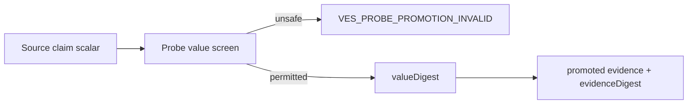

# Probe Value Declassification Design

**Spec:** `.specs/features/probe-value-declassification/spec.md`  
**Status:** Approved

## Architecture

`data-probe` remains the only owner of Probe promotion. It validates raw
source claims, rejects high-confidence sensitive forms, and writes an opaque
digest reference instead of a raw scalar. The existing evidence digest seals
the resulting closed representation. No new package edge or external
dependency is introduced.



## Components

| Component | Location | Change |
| --- | --- | --- |
| Claim normalizer | `packages/data-probe/src/database-knowledge.ts` | Replace raw `value` with `valueDigest`; screen prohibited values. |
| Promotion tests | database-knowledge integration/security suites | Prove absence, rejection, tamper detection, and deterministic output. |
| #34 parser | Deferred to #34 after this merge | Accept the new closed claim shape only. |

## Data Model

```typescript
interface PortableSanitizedClaim {
  readonly factKey: string;
  readonly classification: "public" | "internal";
  readonly valueDigest: `sha256:${string}`;
  readonly untrusted: true;
}
```

`valueDigest` is a provenance reference, not a declassification proof and not
a way to recover a source value. No source scalar is retained in the promoted
artifact.

## Risks & Concerns

| Concern | Mitigation |
| --- | --- |
| A raw value can be low entropy and a plain digest could be guessed. | Do not permit source values with secret/identity shapes; retain no raw bytes. A future value release needs a verified authority contract. |
| Existing consumers expect `value`. | Search shows seed planning uses only `evidenceDigest`; tests will assert the new closed shape and #34 is held until it adopts it. |
| Pattern checks alone cannot classify all sensitive data. | The durable safety property is omission of scalar bytes; patterns add fail-closed defense before hashing. |

## Decisions

- Do not reuse `DeclassificationVerifierPort`: its authority contract is for
  egressed content and adding a new adapter dependency without explicit
  approval is outside this slice.
- Do not copy the Support Bundle scanner; the smaller closed claim model is
  more appropriate than a generic recursive text scanner.
