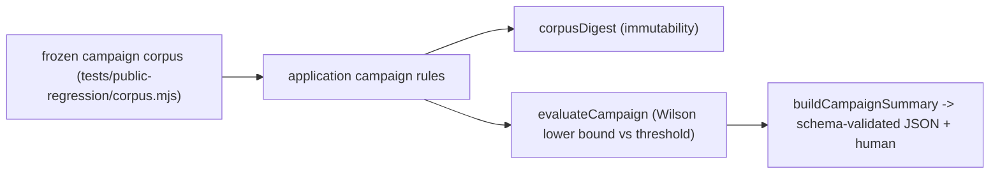

# T73 Public Regression Campaigns Design

**Spec**: `.specs/features/regression-campaigns/spec.md`
**Status**: Drafted for implementation

## Architecture

Pure campaign rules — corpus validation, the immutability digest, the
distribution/confidence math, and the summary allowlist — live in application.
The frozen corpus and the reproducible fixtures live under `tests/`, so the
public campaigns are inspectable and re-runnable from a clean clone. The machine
summary is bound by a JSON schema.



## Components

### Application campaign rules

- **Location**: `packages/application/src/regression/campaigns.ts` (new)
- `CampaignDefinition` `{ id, requirement, owner, threshold, fixtureRef,
  evidenceRef, sampleSize }`.
- `assertCampaignCorpus(defs)`: a closed, ordered set of at least 20; every
  field present and well-formed; no duplicate id; fails closed otherwise
  (`VES_CAMPAIGN_CORPUS_INVALID`).
- `corpusDigest(defs)`: `sha256` over the canonical (sorted-key) definitions, so
  any addition, removal, or edit changes the digest (CAM-01).
- `evaluateCampaign(def, outcomes)`: pure. Given observed boolean outcomes,
  returns `{ id, samples, passes, passRate, lowerConfidenceBound, verdict }`;
  the verdict compares the Wilson 95% lower bound against `threshold` (CAM-03).
- `assertCampaignSummary(summary)`: closed field allowlist + positive-vocabulary
  content check (no path, secret, or provider payload) (CAM-05).
- `buildCampaignSummary(results, corpusDigest)`: the machine summary payload.
- Pure — no filesystem, process, clock, or socket.

### Regression-campaign-summary schema

- **Location**: `schemas/regression-campaign-summary/1.schema.json` (new),
  regenerated into `generated.ts`; a contract test validates a valid summary and
  rejects unknown fields, bad verdicts, and out-of-range distributions.

### The frozen corpus and runner

- **Location**: `tests/public-regression/corpus.mjs` — at least 20 immutable
  campaign definitions plus, for each, a `check()` returning a boolean outcome
  observed from a real, reproducible, local fixture over an existing qualified
  surface (canonical JSON, self-test verdicts, gate-repair convergence, doctor
  report, policy deny, probe read-only, workspace placement, handoff status,
  recovery idempotency, schema validation, cost/latency ceilings). Probabilistic
  campaigns draw outcomes from a seeded reproducible sequence so the distribution
  is real yet deterministic (fake-first: no network, no paid call).
- `tests/public-regression/campaigns.test.mjs`: asserts the corpus is valid and
  immutable (stable digest), runs every campaign, and asserts each verdict
  passes its threshold.
- `tests/system/regression-summary.test.mjs`: end-to-end — runs the corpus,
  builds the machine + human summaries, validates the machine summary against
  the schema, and asserts no leak.

## Data contracts

```typescript
interface CampaignDefinition {
  readonly id: string;
  readonly requirement: string;
  readonly owner: string;
  readonly threshold: number; // pass-rate lower bound in [0, 1]
  readonly fixtureRef: string;
  readonly evidenceRef: string;
  readonly sampleSize: number; // 1 for deterministic
}

interface CampaignRunResult {
  readonly id: string;
  readonly samples: number;
  readonly passes: number;
  readonly passRate: number;
  readonly lowerConfidenceBound: number;
  readonly verdict: "PASS" | "FAIL";
}
```

## Failure strategy

| Failure | Outcome |
| --- | --- |
| Corpus under 20, duplicate id, or missing field | Fail closed before running |
| Lower confidence bound below threshold | Campaign verdict FAIL |
| Summary value carrying a path/secret | Rejected before publish |
| Corpus definition edited | `corpusDigest` changes (immutability detected) |

## Dependency policy

Only existing workspace packages. The Wilson interval is implemented internally
in application (no new dependency), consistent with AD-009.
