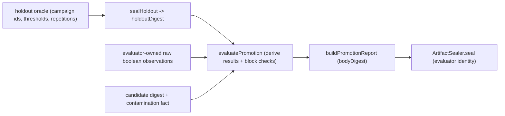

# T74 Sealed-Holdout Evaluator and Promotion Gate Design

**Spec**: `.specs/features/sealed-holdout/spec.md`
**Status**: Drafted for implementation

## Architecture

The promotion verdict is pure and lives in application: it seals the oracle,
checks the block conditions, and decides. The composition root constructs the
evaluator's distinct signing identity, seals the oracle and the promotion report
with the existing `ArtifactSealer`, and never hands the candidate the oracle
contents — only the sealed `holdoutDigest`. The candidate's inputs reach the gate
as facts (a candidate digest and a contamination flag), never as authority.



## Components

### Application promotion rules

- **Location**: `packages/application/src/promotion/promotion-gate.ts` (new)
- `HoldoutOracle` `{ policyId, entries: { campaignId, threshold, repetitionCount }[] }`;
  `canonicalizeOracle(oracle)` is the deterministic serialization that seals the
  oracle digest (thresholds included, so drift changes the digest).
- `evaluatePromotion(input, hash)`: pure. Blocks promotion on
  `VES_PROMOTION_ORACLE_TAMPERED` (recomputed digest != sealed — covers threshold
  drift), `VES_PROMOTION_CANDIDATE_MUTATED`, `VES_PROMOTION_SHARED_IDENTITY`
  (evaluator key id == candidate key id), `VES_PROMOTION_CONTAMINATED`,
  `VES_PROMOTION_INSUFFICIENT_REPETITION` (result samples < oracle repetition), or
  `VES_PROMOTION_CAMPAIGN_FAILED` (a campaign's lower bound below its sealed
  threshold). `PROMOTED` only when no block holds.
- `PromotionObservationPort` returns raw boolean outcomes for one sealed
  campaign at a time. The gate snapshots those outcomes before the candidate
  receives any surface, validates the exact observation set, and calls
  `evaluateCampaign` to derive samples, passes, pass rate, Wilson lower bound,
  and verdict. Candidate facts contain no campaign evidence.
- `buildPromotionReport(input, decision, hash)`: a closed report payload binding
  candidate, holdout, policy, evaluator identity, verdict, block codes, and the admitted campaign evidence (evidenceDigest, added remediating T74 F2), with
  a `bodyDigest` over the canonical body.
- `assertPromotionReport(payload)`: closed allowlist + registered codes only.
- `assertReportUntampered(payload, hash)`: recomputes the body digest;
  `VES_PROMOTION_REPORT_TAMPERED` on mismatch.
- Pure — the `hash` is injected (a sha256 hex function), so no node import.

### Promotion-report schema

- **Location**: `schemas/promotion-report/1.schema.json` (new) + generated type +
  contract tests.

### Composition root

- **Location**: `apps/vestra-cli/src/promotion-composition.ts` (new)
- Constructs the evaluator `NodeEd25519Signer` (key id `holdout-evaluator`,
  distinct from any candidate identity), seals the oracle digest with a
  `node:crypto` sha256, runs `evaluatePromotion`, builds the report, and seals it
  with `ArtifactSealer` bound to the `promotion-report` purpose. The candidate
  receives only the sealed digests.

## Data contracts

```typescript
interface HoldoutEntry {
  readonly campaignId: string;
  readonly threshold: number;
  readonly repetitionCount: number;
}
interface HoldoutOracle {
  readonly policyId: string;
  readonly entries: readonly HoldoutEntry[];
}
interface PromotionObservation {
  readonly campaignId: string;
  readonly outcomes: readonly boolean[];
}
interface PromotionInput {
  readonly oracle: HoldoutOracle;
  readonly sealedHoldoutDigest: string;
  readonly candidateDigestAtSeal: string;
  readonly candidateDigestNow: string;
  readonly evaluatorKeyId: string;
  readonly candidateKeyId: string;
  readonly contaminated: boolean;
  readonly observations: readonly PromotionObservation[];
}
```

## Failure strategy

| Failure | Outcome |
| --- | --- |
| Oracle digest mismatch (threshold drift, edit) | BLOCKED — `VES_PROMOTION_ORACLE_TAMPERED` |
| Candidate digest changed | BLOCKED — `VES_PROMOTION_CANDIDATE_MUTATED` |
| Evaluator identity == candidate identity | BLOCKED — `VES_PROMOTION_SHARED_IDENTITY` |
| Contamination fact true | BLOCKED — `VES_PROMOTION_CONTAMINATED` |
| Result samples below sealed repetition | BLOCKED — `VES_PROMOTION_INSUFFICIENT_REPETITION` |
| Campaign lower bound below threshold | BLOCKED — `VES_PROMOTION_CAMPAIGN_FAILED` |
| Duplicate, extra, or malformed observation | `VES_PROMOTION_INPUT_INVALID` |
| Report body altered | `VES_PROMOTION_REPORT_TAMPERED` |

## Dependency policy

Only existing workspace packages; signing reuses `@verchestra/evidence`, and the
holdout reuses the T73 campaign types. No third-party addition.

## Candidate authority surface (PROM-09, AD-018)

`createCandidateGrant` / `createEvaluatorCandidateGrant` in
`packages/application/src/promotion/promotion-gate.ts`. Every protected asset —
oracle, criteria, evaluator state, pre-seal report — is reachable by name so a
candidate can genuinely attempt it; the evaluator's grant admits none. The
composition root issues the grant over its **real** assets and hands it to the
candidate's own `attempt` hook: a boundary nothing crosses proves nothing, which
is precisely what an independent verifier found when the surface was built but
left unwired.

Read and write are separate capabilities, and the snapshot is structurally
cloned, so a granted read cannot confer deep write into the evaluator's values.

Not claimed: process or storage isolation (#235, post-1.0).
