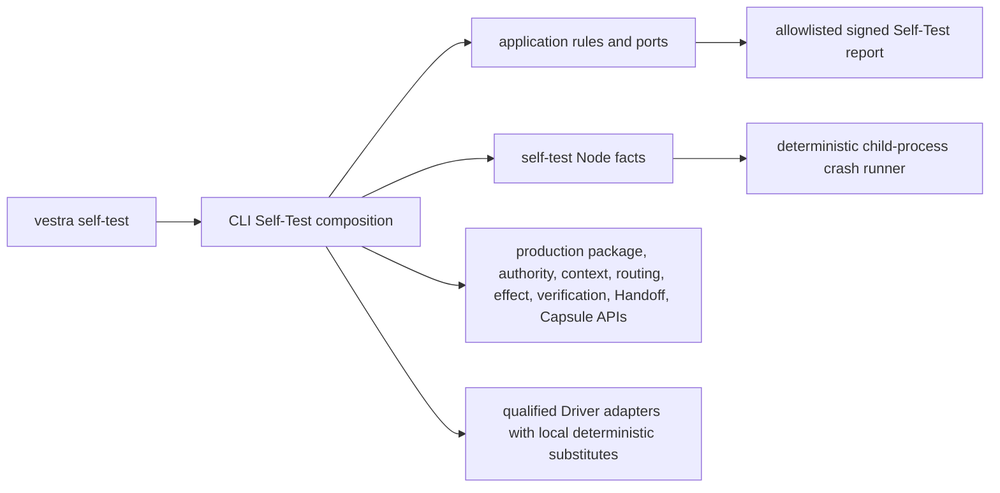

# T71 Full, Fault, and Approved-Driver Self-Test Design

**Spec**: `.specs/features/self-test-full-driver-profiles/spec.md`
**Status**: Approved by issue assignment and maintainer confirmation

## Architecture

T71 extends AD-010's existing three regions. Pure catalogs and verdicts remain
in application, process/filesystem observations remain in the Self-Test adapter,
and the CLI composition root alone constructs sibling production adapters.



## Code reuse

| Existing component | Reuse |
| --- | --- |
| `SelfTestOrchestrator`, coverage, convergence | Run and judge both new scenarios without widening report data |
| `DisposableRootProvider`, fixtures, sentinels, `offlineGuard` | Preserve T69/T70 isolation and no-network guarantees |
| Execution Package and file stores | Produce the real package boundary and stable identity |
| `ApprovalService`, `CapabilityBroker`, `DataEgressFirewall` | Bind and verify the complete Driver review/egress surface |
| Context compiler, model router, budget meter | Exercise deterministic context/routing/cost behavior |
| Effect, verification, Handoff, and Run Capsule coordinators/stores | Exercise existing idempotency and reconciliation semantics |
| Claude Code, Codex, OpenCode drivers | Exercise qualified adapter boundaries with injected local substitutes |
| T65 cross-backend journey tests | Reference expected sequencing only; test helpers are not imported by production code |

## Components

### Application Self-Test scenario contracts

- **Location**: `packages/application/src/self-test/`
- Own closed full/driver check IDs and durable-boundary IDs.
- Accept boundary facts and provider-call facts from ports.
- Reject missing, duplicate, unknown, non-convergent, or unsafe facts.
- Never spawn a process or inspect the filesystem.

### Durable crash adapter

- **Location**: `packages/self-test/src/`
- Launches a repository-owned child entrypoint with an explicit disposable root,
  registered boundary ID, and crash phase (`before | after`).
- Passes no ambient credentials or provider environment.
- Returns exit, journal, residue, and multiplicity facts; it does not decide PASS.
- The child uses the same persisted production stores as the non-crash full
  scenario. A journal is observational evidence, not an alternate source of
  truth or workflow implementation.

### Full scenario composition

- **Location**: `apps/vestra-cli/src/self-test-full-scenario.ts`
- Builds deterministic inputs and production services inside the disposable
  root, then runs the complete path.
- Enumerates the closed durable boundary registry and asks the crash adapter to
  run before/after variants in clean child processes.
- Converts only safe check facts into `SubjectRunFacts`.

### Driver scenario composition

- **Location**: `apps/vestra-cli/src/self-test-driver-scenario.ts`
- Builds one immutable `DriverReviewFacts` value per provider boundary.
- Verifies approval, capability, budget, destination, egress, and read-only Tool
  constraints before constructing or resolving a Driver.
- Uses injected local process/SDK substitutes; the real qualified adapter code
  parses and normalizes their deterministic events.
- Counts each provider-boundary entry so denied paths can prove an exact zero.

### CLI dispatch

- **Location**: existing CLI and Self-Test composition files.
- Extends the accepted profile values and dispatches all four closed profiles.
- Keeps report schema, rendering, exit codes, and guarded-root behavior stable.

## Data contracts

```typescript
interface DurableBoundaryFact {
  boundaryId: FullDurableBoundaryId;
  phase: "before" | "after";
  logicalResultCount: number;
  resumed: boolean;
  semanticFingerprint: readonly string[];
}

interface DriverReviewFacts {
  providerId: "anthropic" | "openai" | "opencode";
  modelId: string;
  destinationId: string;
  maximumCostUsd: number;
  modelCapabilities: readonly string[];
  tools: readonly { name: string; access: "read" }[];
  classification: string;
  purpose: string;
  retention: string;
  egressMode: "online";
}

interface DriverInvocationFacts {
  review: DriverReviewFacts;
  authorized: boolean;
  providerCalls: number;
  writerToolReachable: boolean;
}
```

Exact names may be refined during T1 tests, but the facts/verdict separation and
field semantics are fixed.

## Failure strategy

| Failure | Outcome |
| --- | --- |
| Boundary catalog drift or multiplicity not exactly one | Fail the profile before sealing PASS |
| Child exits unexpectedly or leaves malformed evidence | Fail closed with a registered Self-Test code |
| Unknown effect outcome | Reconcile first; never blind retry |
| Driver authority mismatch | Deny before provider-boundary construction; count remains zero |
| Writer Tool or permission | Deny before invocation |
| Network attempt | Existing `offlineGuard` blocks and records it |
| Provider-local value in portable evidence | Existing structural validators plus focused security assertions reject it |

## Dependency policy

Only existing workspace packages may be added to the CLI import graph. No
third-party package or version change is in scope. Any unexpected need for an
external dependency stops implementation for explicit human approval.
