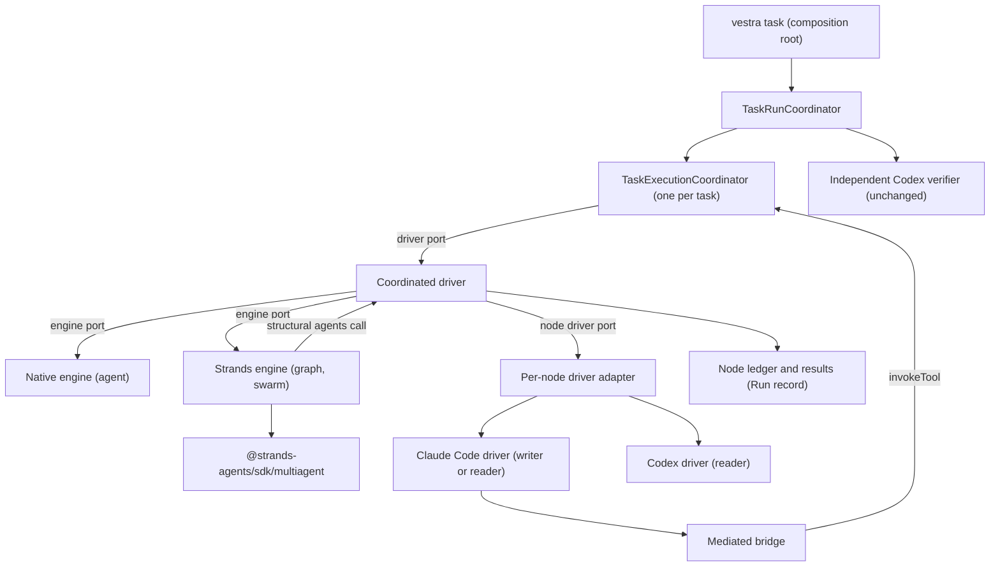
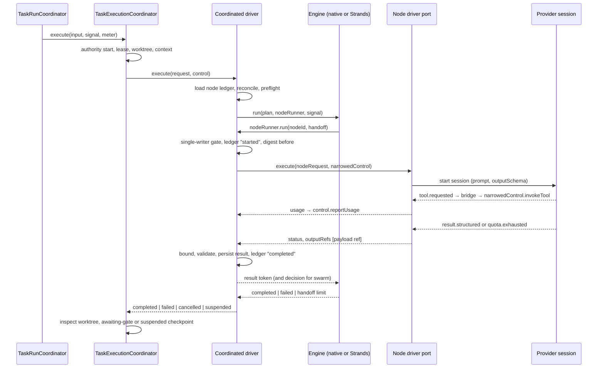
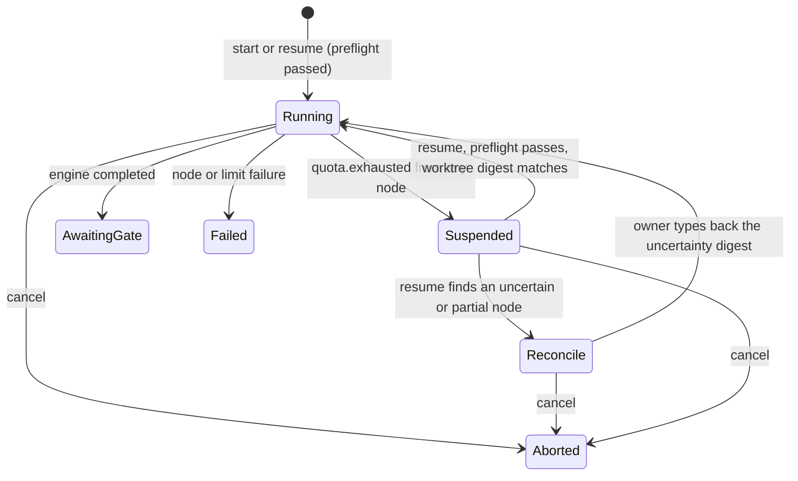
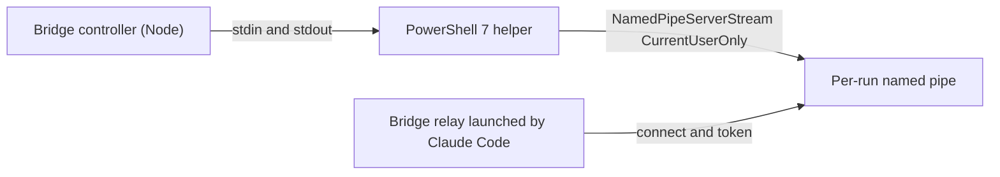

# Strands Subscription Integration Design

**Spec**: `.specs/features/strands-subscription-integration/spec.md`
**Research**: `.specs/features/strands-subscription-integration/research.md`
**Status**: Draft — awaiting the owner decisions D1–D9 in `spec.md`.

---

## Architecture Overview

The SDK becomes one more implementation behind a seam the executor already
has. The task still runs exactly one `TaskExecutionCoordinator.execute`, which
owns the worktree, the writer lease, the context, authority, the budget meter,
and cancellation. Its driver port is filled by a **coordinated driver** instead
of the single implementer. The coordinated driver asks a **coordination engine**
to order the nodes and runs each node through a per-node driver port built from
the existing Claude Code and Codex drivers. Strands is the engine for `graph`
and `swarm`; a native engine runs `agent`.



Dependency direction is unchanged: contracts → domain → application; adapters
depend inward only; `apps/vestra-cli` composes. The Strands engine is an
adapter in `packages/agent-runtime`; it reaches the application's node runner
only through an interface the composition root hands it.

---

## Approaches Considered

| Approach | Verdict | Reason |
| --- | --- | --- |
| **A. Coordinated driver behind the executor's driver port** | **Chosen** | One worktree, one lease, one capability grant, one budget meter, and one cancellation signal cover every node; gates, repair, verification, and review are untouched; the seam already exists (`ExecutionDriverPort`, `packages/application/src/execution/task-executor.ts:229-251`). |
| B. One executor run per node | Rejected | Each run creates its own worktree, lease, and `awaiting-gate` checkpoint; writers would not share a change, and the repair loop and resume shortcut assume one execution per attempt (`task-run.ts` `#attempt`). |
| C. Strands as the outer orchestrator calling `vestra` per node | Rejected | Duplicates approval and budget per node, needs a second authority path, and makes the SDK the owner of run state. |

---

## Module Placement

| Module | Location | Responsibility | May import |
| --- | --- | --- | --- |
| Task Request v2 contract | `schemas/task-request/2.schema.json`; generated `TaskRequestV2` in `packages/contracts/src/generated.ts` | Canonical shape of the request | — |
| v2 normalizer | `packages/application/src/execution/task-request.ts` (dispatch on `schemaVersion`) and `packages/application/src/execution/coordination-plan.ts` | Exact-shape checks, topology, scope, writer ordering, limits with defaults and ceilings; deep-frozen result | contracts, domain |
| Node-result and handoff contracts | `packages/application/src/execution/node-result.ts` | Closed draft-07 JSON Schemas per node and a hand-written validator with byte bounds | domain |
| Coordinated driver | `packages/application/src/execution/coordinated-driver.ts` | `ExecutionDriverPort` over an engine port and a node driver factory; node ledger transitions; single writer; write-scope narrowing; result limits; quota → suspension | application, domain |
| Engine port and native engine | `packages/application/src/execution/coordination-engine.ts` | `CoordinationEngine` interface; `NativeAgentEngine` for mode `agent` | application |
| Executor suspension | `packages/application/src/execution/task-executor.ts`, `task-run.ts` | Driver status `suspended`; preserve worktree; outcome `SUSPENDED`; resume from a `suspended` checkpoint | — |
| Driver events | `packages/domain/src/driver-event/driver-event.ts` | Two new rows: `result.structured`, `quota.exhausted` | — |
| Claude Code driver | `packages/drivers/src/claude-code-driver.ts` | `--json-schema`; bounded `structured_output`; `apiKeySource` check; `rate_limit_event` mapping; Windows policy locations (T7) | domain, application |
| Codex driver | `packages/drivers/src/codex-driver.ts` | `outputSchema` on `turn/start`; `account/read`; `account/rateLimits/read`; `usageLimitExceeded` mapping; method allowlist | domain, application |
| Driver execution adapter | `packages/agent-runtime/src/execution/driver-execution-adapter.ts` | Turns `result.structured` into a payload reference in `outputRefs`; forwards `quota.exhausted` | application, domain |
| **Strands engine** | `packages/agent-runtime/src/coordination/strands/` (`strands-engine.ts`, `structural-agent.ts`, `handoff-schema.ts`), exported only as `@verchestra/agent-runtime/strands-coordination` | Builds `Graph`/`Swarm` from the plan; structural agents; Zod decision schemas; maps SDK outcomes to stable codes | `@strands-agents/sdk/multiagent`, `zod`, application |
| Bridge transport seam | `packages/agent-runtime/src/execution/mcp-tool-bridge.ts` plus `bridge-transport.ts` | Controller takes a `BridgeTransport`; Unix socket implementation extracted unchanged | application |
| Windows pipe transport | `packages/platform-node/src/windows-pipe-transport.ts` with its constant PowerShell 7 script; `windows-acl.ts` | Named pipe through the helper; ACL proof; policy-source probe | application |
| Composition | `apps/vestra-cli/src/task/` (`task-plan.ts`, `task-run.ts`, `task-status.ts`, new `task-coordination.ts`, `task-billing.ts`) | Parse v2; present topology; preflight; build the node driver factory; dynamic import of the Strands subpath; status and resume | any |
| Sealed build check | `scripts/t76-build-candidate.mjs` | Metafile-based self-containment (decision D2) | — |

The agent-runtime package gains a second `exports` entry, following
`@verchestra/platform-node/secrets`. Its main entry never imports
`src/coordination/strands/`; an architecture test pins that, the subpath-only
SDK import, and the ban on `Agent`, `models/*`, `McpClient`, `SessionManager`,
`telemetry`, and `vended-*` imports.

---

## Code Reuse Analysis

| Existing module | Location | How it is used |
| --- | --- | --- |
| Executor and its ports | `packages/application/src/execution/task-executor.ts` | Unchanged authority, scope, protected-path, grant, receipt, budget, and cancellation checks for every node; gains the `suspended` status |
| Driver session runner (AD-048) | `packages/agent-runtime/src/execution/driver-session-runner.ts` | Each node session starts, stops, and closes through it |
| Driver execution adapter | `packages/agent-runtime/src/execution/driver-execution-adapter.ts` | Per-node driver port for Claude Code; read scope from the node; result payload added |
| Provider child run (AD-060) | `packages/drivers/src/provider-child-run.ts` | Unchanged process lifecycle for each node |
| Typed Driver event (AD-063) | `packages/domain/src/driver-event/driver-event.ts` | Two new rows in the closed table |
| Task-path module (AD-058) | `packages/domain/src/primitives/task-path.ts` | `isWithinTaskScope`, `isProtectedTaskPath`, `taskPathsOverlap` for node scopes |
| Run record (AD-047, AD-052, AD-061) | `apps/vestra-cli/src/task/task-run-record.ts` | Gains the sealed node ledger and node results, validated on read |
| Budget meter (AD-055, AD-056) | `packages/application/src/execution/budget-meter.ts` | One ledger across nodes and resumes; resumed ledgers already backdate their start by consumed active time, so suspended time is not counted |
| Provider auth and Codex identity (AD-044) | `apps/vestra-cli/src/task-provider-auth.ts`, `task/task-codex-identity.ts` | Subscription mode required for every provider of a v2 run |
| Provider processes | `apps/vestra-cli/src/task/task-process-tree.ts` | Already tracks several sessions by pid; cancel reaches every node |
| Payload store | `packages/agent-runtime/src/execution/execution-payload-store.ts` | Holds a node's result bytes in process before the Run record persists them |
| Windows PowerShell guard | `packages/platform-node/src/os-secret-backends/windows-credential-manager.ts:171-187` | Script-block logging and transcription refusal reused by the pipe helper |
| Process-tree terminator (AD-049, AD-054) | `packages/drivers/src/driver-process-tree.ts` | `taskkill /T /F` for the helper and Claude Code on Windows |

---

## Task Request v2

```jsonc
{
  "schemaVersion": 2,
  "sourceRevision": "<40 or 64 hex>",
  "task": { /* identical to v1 */ },
  "gates": [ /* identical to v1 */ ],
  "budgets": { "maximumCostUsd": 5, "maximumTokens": 2000000, "maximumDurationMs": 3600000 },
  "onGateFailure": { /* optional, identical to v1 */ },
  "verifier": { "driverId": "codex", "model": "gpt-…" },
  "instructions": "task-level instructions (untrusted, same grammar as v1)",
  "execution": {
    "mode": "graph",
    "nodes": [
      {
        "nodeId": "plan",
        "driver": { "driverId": "codex", "model": "gpt-…" },
        "description": "Reads the scope and proposes a change plan",
        "instructions": "node instructions (untrusted)",
        "readScope": ["packages/example"],
        "writeScope": [],
        "inputs": []
      },
      {
        "nodeId": "build",
        "driver": { "driverId": "claude-code", "model": "claude-…" },
        "description": "Writes the change",
        "instructions": "…",
        "readScope": ["packages/example"],
        "writeScope": ["packages/example/src"],
        "inputs": ["plan"]
      }
    ],
    "edges": [{ "from": "plan", "to": "build" }],
    "limits": { "concurrency": 1 }
  }
}
```

- **Members by mode.** `agent`: exactly one node, no `edges`, `start`, or
  `handoffs`. `graph`: `edges` (may be empty for one node), no `start` or
  `handoffs`. `swarm`: `start` and `handoffs`
  (`[{ "from": "reviewer", "to": ["writer"] }]`), no `edges`, every node's
  `inputs` empty, at least two nodes.
- **Grammar.** `nodeId` `^[a-z][a-z0-9-]{0,31}$`, unique; `description` printable
  ASCII up to 256 characters; node `instructions` the v1 instruction grammar
  (8192 characters, 16 KiB, no control or bidirectional characters); scopes the
  v1 `changeScope` path grammar, 0–100 entries; models as in v1 (`claude-…`,
  `gpt-…`) and priced in `model-price-table`.
- **Cross-field rules** (SSI-25..27): acyclic; every node reachable from a
  source; `inputs` ⊆ ancestors; scopes ⊆ `task.changeScope`; write scopes clear
  of `task.protectedPaths`; Codex nodes have an empty write scope; at least one
  writer; every pair of writers ordered by a path (graph) — a swarm runs one node
  at a time; handoff targets are other existing nodes.
- **Limits.** Absent members take the defaults (SSI-37); present members must
  not exceed the ceilings (SSI-38). The normalized form always carries all
  seven: `concurrency`, `maxNodes`, `maxEdges`, `maxSwarmAgents`,
  `maxHandoffs`, `nodeResultBytes`, `runResultBytes`.
- **Removed from v1.** The top-level `driver` member: in v2 every node names its
  own driver. Authentication, credentials, billing, executables, and endpoints
  have no member (`additionalProperties: false`, SSI-24).
- **Generator.** Before T3, `scripts/generate-contract-types.mjs` read only
  `1.schema.json` per directory. T3 extends it to every `<n>.schema.json`
  (`schemaVersions`, in ascending order), with
  the schema `title` naming the type (`TaskRequestV2`), and the v1 output stays
  byte-identical.

### Approval coverage

`task plan` already binds the request through the Execution Package:
`executionContractDigest: canonicalDigest(request)`
(`apps/vestra-cli/src/task/task-plan.ts` `packageInput`) is sealed in the
package, and the package digest is in the approval binding. A v2 normalized
request therefore binds every node, model, instruction, description, scope,
input, edge, start, handoff target, and effective limit (SSI-28). The review
surface adds presentation only: `selectedPassports` lists one
`<driver>:<model>` per node plus the verifier, `destinations` names each
provider used, and `capabilities` carries `worktree-write` because a writer
exists. A discrimination test mutates each descriptor field and asserts a new
binding digest.

---

## Node Execution Path



- **Narrowed control.** `invokeTool` refuses a target outside the node's write
  scope (or any write from a reader) before delegating to the executor's
  `invokeTool`, which re-applies task scope, protected paths, grant, and
  tool-effect authority (SSI-15, SSI-41). `reportUsage` forwards to the run's
  meter. `checkpoint` stages are prefixed `node-…`. The signal is the
  executor's, combined with the coordinated driver's own stop.
- **Single writer.** A mutex in the coordinated driver serializes writer nodes;
  normalization already guarantees that the engine never makes two writers ready
  at once, so the mutex is defence in depth (SSI-40).
- **Prompt.** Built by the application from the approved node and task fields,
  the declared inputs' persisted results, and the swarm handoff message, each
  marked untrusted, following `implementerPrompt` in
  `apps/vestra-cli/src/task/task-implementer.ts`. The SDK's assembled input is
  ignored (SSI-06, SSI-50).
- **Per-node driver factory.** Built in the composition root: a Claude Code node
  is a `DriverExecutionAdapter` with the subscription profile, the node's read
  scope, and the node's output schema; a Codex node is a reader session over the
  same worktree with read-only dynamic tools and `outputSchema`.

---

## Node Results and Payload Transport

1. **Driver events.** `result.structured { value: value, bytes: count }` and
   `quota.exhausted { scope: text, resetsAt: text? }` join the closed table of
   AD-063. A driver emits `result.structured` only after it has bounded the
   provider's JSON to the node limit it was given (refusing larger output with
   its own `…_OUTPUT_LIMIT` code).
2. **Claude Code.** The mediated invocations gain `--json-schema <schema>` when
   the start request carries a schema. The final `result` event's
   `structured_output` becomes `result.structured`; `success` without it, or
   `error_max_structured_output_retries`, fails the session
   (`VES_CLAUDE_STRUCTURED_OUTPUT_MISSING`).
3. **Codex.** `turn/start` carries `outputSchema`; the final assistant message
   is parsed as JSON within the bound and emitted as `result.structured`.
4. **Adapter.** `DriverExecutionAdapter` puts the canonical JSON bytes in the
   process payload store and returns `outputRefs: [payloadRef]` instead of
   `[]` (`driver-execution-adapter.ts:109`) (SSI-48).
5. **Coordinated driver.** Resolves the reference, re-checks the per-node and
   per-run byte limits, validates against the node schema, then persists the
   bytes and digest in the Run record before marking the visit completed
   (SSI-46, SSI-47).
6. **Run record.** A sealed `coordination` member: the node ledger
   (`{ nodeId, visit, state, startedAt, endedAt, changeDigestBefore,
   receiptCount, resultDigest?, failureCode? }`) and result files named by
   digest, validated on read like every other member (AD-061). Nothing else from
   a session is persisted (SSI-49).
7. **To the SDK.** The structural agent returns
   `{ type: "agentResult", stopReason: "endTurn", lastMessage: { role: "assistant",
   content: [{ type: "textBlock", text: "verchestra-result:<payload ref>" }] },
   invocationState, structuredOutput? }` — no provider text (SSI-07).

### Node-result and handoff schemas

Both are closed draft-07 objects that Claude Code and Codex accept:

```json
{ "type": "object", "additionalProperties": false,
  "required": ["outcome", "summary"],
  "properties": {
    "outcome": { "enum": ["done", "blocked"] },
    "summary": { "type": "string", "maxLength": 8192 } } }
```

A swarm node's schema adds two required members:
`"next": { "enum": ["<declared target>", "…", "<complete>"] }` and
`"message": { "type": "string", "maxLength": 4096 }`. The application owns
these schemas and their validator. The Strands adapter builds the same shape in
Zod, and a contract test asserts `z.toJSONSchema(zodSchema, { target: "draft-7" })`
equals the application's schema for every node, so the CLI, the application,
and the SDK check one shape. The adapter maps `next` to the SDK's
`{ agentId?, message }`, omitting `agentId` for `<complete>`, and also checks
the result with the `structuredOutputSchema` the SDK passed (SSI-43, SSI-44).

---

## Strands Engine

- **Import.** `import { Graph, Swarm } from "@strands-agents/sdk/multiagent"`
  only (SSI-02). Status strings are compared as literals.
- **Graph.** `new Graph({ id: "verchestra", nodes, edges, sources,
  maxConcurrency: limits.concurrency, maxSteps: nodes.length, timeout,
  nodeTimeout })`, where `timeout` and `nodeTimeout` are the remaining duration
  budget (SSI-09). A node failure ends the run failed once the SDK settles; a
  thrown `max steps` or `timeout` maps to `VES_COORDINATION_LIMIT` or the
  executor's budget stop.
- **Swarm.** `new Swarm({ id: "verchestra", nodes, start, maxSteps:
  maxHandoffs + 1, timeout, nodeTimeout })` with repetitive-handoff detection
  off; `max steps` maps to `VES_COORDINATION_HANDOFF_LIMIT` (SSI-45).
- **Resume.** No SDK session manager. On resume a structural agent whose visit
  is completed in the ledger returns its persisted result without a session
  (SSI-65). A swarm restarts with `start` set to the pending handoff target and
  its recorded message, and `maxSteps` reduced by the handoffs already taken.
- **Errors.** A structural agent throws `new Error("<VES_* code>")` only. The
  SDK's default logger prints `node_id=<id>, error=<code> | node execution
  failed` to stderr; node identifiers come from the approved plan, so the line
  carries nothing sensitive. `configureLogging` is root-only and is not used.
- **Telemetry.** No tracer provider is registered anywhere in Verchestra, so the
  SDK's spans are no-ops; an architecture test forbids `@opentelemetry/sdk-*`
  and the SDK's `./telemetry` subpath.
- **Native engine.** Mode `agent` calls the node runner once and needs no SDK
  (D5).

---

## Suspension State Model

`INTERRUPTED` is terminal (`packages/domain/src/workflow/workflow-machine.ts:34-41`)
and stays so (SSI-64). Suspension is an executor checkpoint stage; the
workflow state stays `IMPLEMENTING`, which `task resume` already accepts
(`packages/application/src/execution/task-run.ts:126`).



| Concern | Rule |
| --- | --- |
| Entering | The coordinated driver stops scheduling, aborts running nodes, waits for their sessions to close, records each as failed (no effect) or partial (effects landed), and returns `suspended` with `{ reason, provider, at, resetsAt? }` (SSI-59, SSI-61). |
| Executor | On `suspended` it saves checkpoint `suspended` with the change digest and the node-ledger digest, keeps the worktree, releases the writer lease, and throws `VES_EXECUTOR_SUSPENDED`; it does not run its failure cleanup (`task-executor.ts:605-637`). |
| Run coordinator | Maps `VES_EXECUTOR_SUSPENDED` to outcome `SUSPENDED`, applies no workflow command, and does not call `release()`; the command exits non-zero with the suspension surface; `releaseActive` frees the run (SSI-60). |
| Budget | The ledger snapshot is saved; a resumed meter backdates its start by consumed active time only (SSI-68). |
| Resume | Preflight (SSI-51, SSI-52), approval and policy revalidation, worktree reopened through the idempotent `create` and its change digest compared with the checkpoint (`VES_EXECUTOR_WORKTREE_DRIFT` on mismatch), ledger reconciliation, then the engine restarts with completed visits replayed (SSI-33, SSI-65). |
| Uncertain or partial node | Resume refuses with `VES_TASK_NODE_UNCERTAIN` and status shows the node, its receipts, and its uncertainty digest; `vestra task resume --reconcile <digest>` re-runs that node on the current worktree (D4) (SSI-66). |
| Failed node without effect | Re-run on resume and recorded as such (SSI-67). |
| Approval expiry | A run suspended past its approval's expiry is refused; the owner plans again. |

---

## Subscription Preflight and Effective-Method Checks

At `start` and `resume`, before any workflow transition (SSI-51..53, SSI-56):

1. `task-providers.json` names `subscription` for every provider of the run,
   verifier included.
2. `task-billing.json` (machine-local, beside `task-providers.json`) holds, per
   provider, `{ "auth": "subscription" | "chatgpt", "extraUsage": "disabled",
   "confirmedAt": "<UTC>", "planType"?: "<codex plan type>" }` and nothing else.
   Its schema forbids any other member; no account identifier, e-mail address,
   token, or path can be stored. A missing, malformed, or mismatched entry is
   `not configured`.
3. The Codex identity directory is logged in with ChatGPT
   (`requireCodexSubscription`, AD-044).

Per session (SSI-54, SSI-55, SSI-57, SSI-58):

- **Claude Code.** The init event's `apiKeySource` must be `none`; any other
  value fails the session before the first tool effect. `rate_limit_event`
  `rejected` emits `quota.exhausted` with `resetsAt` if given; `allowed_warning`
  emits a `warning`. No `--fallback-model`, `--max-budget-usd`, or API-key
  helper is ever passed.
- **Codex.** Before `turn/start`: `account/read` must return `type: "chatgpt"`;
  `account/rateLimits/read` must report no credit balance and no unlimited
  credits (`VES_CODEX_CREDITS_PRESENT`), and `ordinaryUsageAllowed !== false`
  (otherwise `quota.exhausted` before the turn). During the turn:
  `codexErrorInfo: "usageLimitExceeded"`, and `account/rateLimits/updated`
  with a usage-limit or credits-depleted `rateLimitReachedType`, emit
  `quota.exhausted`. The driver's JSON-RPC client sends only an allowlist of
  methods; `account/rateLimitResetCredit/consume`,
  `account/sendAddCreditsNudgeEmail`, and every `account/login*` method are
  absent from it. The plan type may be compared with the confirmation; the
  e-mail address is discarded on receipt.

---

## Windows Transport



- **Seam.** `BridgeTransport { open(): Promise<{ endpoint: string; next():
  Promise<Duplex>; close(): Promise<void> }> }`. The Unix implementation is the
  current directory, socket, mode, and owner checks moved unchanged; the
  controller keeps authentication, framing, single connection, timeouts, and
  dispatch (SSI-69, SSI-70).
- **Pipe.** Name `verchestra-<32 hex>` from 128 random bits; the helper is
  launched from a pinned absolute PowerShell 7 path with `-NoProfile
  -NonInteractive -File <constant script> <name>`, never `-Command -`; it
  creates `NamedPipeServerStream(name, InOut, 1, Byte, CurrentUserOnly |
  FirstPipeInstance | Asynchronous)`, accepts one client, and copies bytes in
  both directions with its standard streams; it parses no frame (SSI-71,
  SSI-72).
- **Prerequisites.** The helper refuses when script-block logging or
  transcription is enforced (reusing the credential-manager guard); the per-run
  directory's ACL is set and then read back as owner-only (the current user's
  SID with full control, inheritance off) before the token is written; the
  policy probe checks the directory and the two registry keys (SSI-73, SSI-74).
- **Lifetime.** The controller owns both processes; on any end it closes the
  helper's input, then ends both trees with the terminator, then removes the
  per-run directory (SSI-75).
- **Qualification.** The pinned refusal tests listed in `research.md` change in
  the same commit that lifts the refusals, after the Windows runner passes
  (SSI-77).

---

## Bundle Impact

- Today: `launcher:vestra` and `launcher:verchestra` are 824 KiB each.
- The adapter's closure (`./multiagent` plus Zod, the AWS runtime client
  modules, the MCP client modules, and `@opentelemetry/api`) is about 1451 KiB
  minified. The sealed build has no code splitting, so the literal dynamic
  import is inlined into both launchers: about 2.3 MiB each, evaluated only on a
  graph or swarm run.
- The root entry cannot be used (unprefixed built-ins). Even the subpath trips
  the textual self-containment check on a string literal; decision D2 replaces
  that check with an exact one over esbuild's metafile. If D2 is declined, the
  composition reports graph and swarm as `not configured` in a sealed release
  and the closure is excluded by an esbuild `external` plus a guard — a smaller
  feature, not a weaker gate.
- T5 records the measured sizes and cold-start time of `vestra --version` and of
  the activation health check before and after.

---

## Error Handling Strategy

New codes travel as the `reason` of existing public codes, so the runtime error
catalog keeps its count of 19.

| Error scenario | Handling | User impact |
| --- | --- | --- |
| Invalid descriptor | `VES_TASK_REQUEST_EXECUTION_INVALID` at plan, nothing persisted | `VES_TASK_REQUEST_REJECTED` with that reason |
| Provider not on subscription, missing confirmation | `not configured` before any transition | `VES_TASK_NOT_CONFIGURED` naming the requirement |
| Wrong effective method | `VES_CLAUDE_AUTH_METHOD_MISMATCH`, `VES_CODEX_AUTH_METHOD_MISMATCH`; node fails, run fails | `VES_TASK_FAILED` with that reason |
| Codex credits present | `VES_CODEX_CREDITS_PRESENT`; run stops before the turn | `VES_TASK_NOT_CONFIGURED` |
| Quota exhausted | Suspension; outcome `SUSPENDED` | Status shows provider and reset time; next action `vestra task resume` |
| Invalid or oversized result, undeclared destination | `VES_COORDINATION_RESULT_INVALID`, `…_RESULT_TOO_LARGE`, `…_HANDOFF_UNDECLARED`; run fails | `VES_TASK_FAILED` |
| Handoff or step limit | `VES_COORDINATION_HANDOFF_LIMIT`, `VES_COORDINATION_LIMIT` | `VES_TASK_FAILED` |
| Uncertain node on resume | `VES_TASK_NODE_UNCERTAIN`; nothing runs | Status shows the uncertainty digest |
| Worktree changed while suspended | `VES_EXECUTOR_WORKTREE_DRIFT` | `VES_TASK_FAILED` |
| Windows prerequisite missing | `not configured` with the prerequisite | `VES_TASK_NOT_CONFIGURED` |

---

## Risks & Concerns

| Concern | Location (file:line) | Impact | Mitigation |
| --- | --- | --- | --- |
| The executor removes the worktree on every failure | `packages/application/src/execution/task-executor.ts:624` | A suspension would lose completed writer nodes' effects | Typed `suspended` status that skips cleanup (T6), with a test that a suspended worktree survives |
| The driver adapter returns no output | `packages/agent-runtime/src/execution/driver-execution-adapter.ts:109` | Node results cannot travel | `result.structured` → payload reference (T4) |
| The contract generator reads only version 1 (before T3) | `scripts/generate-contract-types.mjs` directory loop | A v2 schema would get no generated type | Generator extension with a parity test (T3) |
| Textual self-containment check | `scripts/t76-build-candidate.mjs:318-326` | False positive on the SDK's string literal | Metafile-based check, owner decision D2 (T5) |
| Windows policy locations (before T7) | `packages/drivers/src/claude-code-driver.ts` managed-policy paths, which off macOS named only `/etc/claude-code` | Lifting the refusal alone would check `/etc/claude-code` on Windows and pass | Windows sources first, refusal lifted last (T7) |
| No bridge transport seam | `packages/agent-runtime/src/execution/mcp-tool-bridge.ts:113` | A second transport would duplicate the controller | Extract the seam with the Unix transport unchanged (T7) |
| Codex minimum version 0.115.0 | `packages/drivers/src/codex-driver.ts:254` | `outputSchema` and account reads may be absent | Raise and requalify (T4) |
| SDK logger prints to stderr | `@strands-agents/sdk` `dist/src/multiagent/nodes.js:72` | Diagnostics escape the CLI's JSON | Structural errors carry codes only; a test asserts the stderr line's content (T5) |
| Swarm trusts custom output | `dist/src/multiagent/swarm.js:229-247` | An unknown target crashes the swarm | Structural agents validate before returning (T5) |
| Required peers outside the approval | `@strands-agents/sdk` `package.json` `peerDependencies` | Unapproved packages in the lockfile | Owner decision D1 before T5 |
| No license notice in the sealed build | `scripts/t76-build-candidate.mjs:124,163-166` | Apache-2.0 `NOTICE` obligations not surfaced | Recorded in T9 for the release owner; not widened here |

---

## Tech Decisions

| Decision | Choice | Rationale |
| --- | --- | --- |
| Where nodes plug in | The executor's driver port | Reuses every governed control (approach A) |
| SDK surface | `./multiagent` subpath only | Bundles cleanly; no model, MCP client, or sandbox reachable by name |
| Result to the SDK | A payload-reference token | Model text never feeds the SDK's input merge |
| Handoff schema | Closed, required `next` enum and bounded `message` | Accepted by both CLIs; destinations enforced per node |
| Suspension | Executor checkpoint stage, workflow stays `IMPLEMENTING` | `INTERRUPTED` stays terminal; resume path already accepts the state |
| Billing proof | Owner confirmation plus per-session effective-method checks plus typed quota signals | No local read of the server-side setting exists |
| Windows server | PowerShell 7 .NET helper over parent stdio | Node cannot set `CurrentUserOnly` or first-instance on a pipe |

Project-level decisions are recorded in `.specs/STATE.md` as the AD entries
"to be numbered at merge" that follow AD-067.
