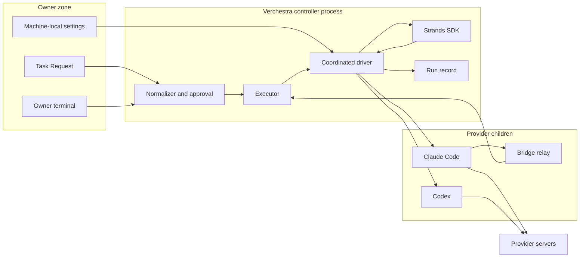

# Strands Subscription Integration Threat Model

Produced with the `security-threat-model` skill (commit `120b676`). The skill's
step 6 asks the owner to confirm the assumptions before the report is final;
that check-in could not run inside this task, so the assumptions below are
open decision D7 in `spec.md` and every recommendation that depends on them is
marked conditional. Requirement IDs (SSI-nn) refer to `spec.md`.

## Executive summary

The integration adds three things a governed task never had: third-party
orchestration code running in the controller process, several model sessions
whose outputs feed each other, and a billing constraint that no local check can
fully prove. The highest risks are (1) the SDK reaching a model provider on its
own with ambient AWS credentials, (2) paid usage continuing after a
subscription allowance through usage credits or an API-key overlay, (3) model
output steering a later writer node or a swarm handoff beyond what the owner
approved, and, on Windows only, (4) another local user reaching the bridge pipe.
The design closes (1) by construction and test, narrows (3) to the approved plan
at every node, and bounds (2) with an owner statement plus per-session
effective-method checks and typed quota signals; the server-side billing
setting itself remains unverifiable and is the main residual risk.

## Scope and assumptions

- **In scope:** the Task Request v2 contract and normalizer
  (`schemas/task-request/`, `packages/application/src/execution/`), the
  coordinated driver and engines, the Strands adapter
  (`packages/agent-runtime/src/coordination/strands/`), the driver changes
  (`packages/drivers/src/claude-code-driver.ts`, `codex-driver.ts`), the bridge
  transport seam and the Windows pipe transport, the billing preflight and
  suspension in `apps/vestra-cli/src/task/`, the Run record additions, and the
  sealed build's self-containment check.
- **Out of scope:** the SDK's own model providers, MCP client, tools, and
  servers (never constructed); the release, TUF, and activation chain beyond the
  bundle content; CI infrastructure; the providers' servers.
- **Assumptions (to confirm, D7):**
  - One owner operates one machine; Verchestra runs as that user.
  - Other local users are hostile; other processes of the same user are out of
    scope, as in `.specs/features/governed-task-cli/threat-model.md`.
  - Repository content, Task Request text, model output, and node results are
    untrusted and may carry prompt injection.
  - The owner's `task-providers.json` and `task-billing.json` are trusted
    operator input; the owner can lie in them only against themselves.
  - The provider CLIs at their qualified versions report quota and
    authentication facts truthfully.
- **Open questions that change ranking:** whether a Team or Enterprise plan
  (server-managed settings) is in scope (G1 of AD-044); whether the owner's
  accounts have usage credits or a Codex credit balance today; whether Windows
  is a near-term target.

## System model

### Primary components

- **`vestra task` composition root** — parses requests, runs preflight, builds
  node drivers (`apps/vestra-cli/src/task/task-run.ts`).
- **Executor** — the single authority for scope, protected paths, grants,
  receipts, budgets, and cancellation
  (`packages/application/src/execution/task-executor.ts`).
- **Coordinated driver and native engine** — run a coordination plan inside the
  executor (`packages/application/src/execution/coordinated-driver.ts`, new).
- **Strands adapter** — third-party code in process; orders nodes through
  structural agents (`packages/agent-runtime/src/coordination/strands/`, new).
- **Claude Code and Codex drivers** — provider child processes with mediated or
  read-only tools (`packages/drivers/src/`).
- **Mediated bridge** — relay launched by Claude Code; controller channel over a
  Unix socket or, on Windows, a named pipe through a PowerShell 7 helper
  (`packages/agent-runtime/src/execution/mcp-tool-bridge.ts`).
- **Run record** — sealed durable state, now with the node ledger and results
  (`apps/vestra-cli/src/task/task-run-record.ts`).
- **Independent verifier** — Codex on a scratch checkout, unchanged
  (`apps/vestra-cli/src/task/task-verifier.ts`).

### Data flows and trust boundaries

- **Task Request file → normalizer.** JSON up to 256 KiB from the owner's
  disk; untrusted; closed schema, cross-field rules, deep freeze; bound into the
  approval by the Execution Package digest.
- **Owner terminal → approve, resume `--reconcile`, review.** Typed-back
  digests; local human authority, not identity.
- **Machine-local settings → preflight.** `task-providers.json` and
  `task-billing.json` read as bounded regular files, never followed through a
  link; closed schemas; no secret content.
- **Controller → SDK (in process).** Plan-derived IDs, limits, and structural
  agents; no credentials, no prompts, no model text. The SDK returns statuses
  and our own result tokens.
- **Controller → provider child.** Prompt over standard input, a closed output
  schema, a per-run isolated home and configuration; the subscription token
  only in the child environment (Claude Code) or the identity directory (Codex).
- **Provider child → controller.** `stream-json` (Claude Code) or JSON-RPC
  (Codex) over pipes; bounded, parsed, normalized into typed Driver events;
  init identity and `apiKeySource` checked; structured result bounded before
  emission.
- **Bridge relay → controller.** Unix socket in a `0700` directory or a
  `CurrentUserOnly` first-instance named pipe; 256-bit token; one connection;
  8 MiB frames; every write re-checked by the narrowed control and then the
  executor.
- **Controller → Run record.** Digest-bound, sealed members; results bounded
  and schema-validated before persistence.
- **Provider child → provider servers.** TLS by the CLIs; outside Verchestra's
  control except through flags and isolation.

#### Diagram

## Assets and security objectives

| Asset | Why it matters | Security objective (C/I/A) |
| --- | --- | --- |
| Owner's money (usage credits, Codex credits, any AWS account) | The owner forbids any paid usage beyond the subscriptions | I (no unauthorized spend) |
| Subscription token and Codex identity | Grants the owner's plan to whoever holds it | C |
| Repository outside node and task scopes, protected paths | Integrity of the owner's code and policy | I |
| Approval binding | Sole authority for what runs | I |
| Node ledger, node results, checkpoints | Decide what resume repeats or skips | I |
| Subscription allowance | Exhaustion blocks the owner's other work | A |
| Owner identity data (account e-mail, plan) | Personal data | C |
| Sealed release bundle | Every user runs it | I |

## Attacker model

### Capabilities

- Writes repository content, issue text, or documents the task reads (prompt
  injection into any node).
- Shapes a model's output, and so a node result or handoff decision.
- Publishes a malicious version of a transitive npm package (supply chain).
- On Windows, runs as another local user and can create named pipes or connect
  to them.
- Sets environment variables in the owner's shell profile only if they already
  control the owner's account (then out of scope).

### Non-capabilities

- No network path to the controller; nothing listens on a network port.
- Cannot run code as the owner's user (same-user processes are out of scope).
- Cannot change the owner's provider account settings.
- Cannot alter the approved Execution Package without the workspace evidence
  key.

## Entry points and attack surfaces

| Surface | How reached | Trust boundary | Notes | Evidence (repo path / symbol) |
| --- | --- | --- | --- | --- |
| Task Request v2 | `vestra task plan --request` | Owner file → normalizer | Closed schema; topology rules | `schemas/task-request/2.schema.json`, `normalizeTaskRequest` |
| Node prompt inputs | Upstream results, handoff message, repository context | Model output → next model | Labelled untrusted; no authority | `implementerPrompt` pattern, coordinated driver |
| Swarm handoff decision | Structured output of a node | Model → SDK routing | Closed per-node enum | `handoff-schema.ts` (new) |
| Provider streams | Child stdout | Child → controller | Bounded parsing, typed events | `claude-code-driver.ts` `claudeProtocol`, `codex-driver.ts` |
| Bridge channel | Relay connect | Relay → controller | Token, one connection, frame bound | `mcp-tool-bridge.ts`, Windows pipe transport (new) |
| PowerShell helper | Controller spawn | Controller → helper | Constant script; pipe name argument only | `windows-pipe-transport.ts` (new) |
| Machine-local settings | Owner-written files | Owner → preflight | Closed, bounded, no secrets | `task-provider-auth.ts`, `task-billing.ts` (new) |
| Resume reconciliation | `task resume --reconcile <digest>` | Owner terminal → controller | Typed-back digest | `task-run.ts` |
| SDK code | In-process import | Third-party code → controller | Subpath only; no models | `@verchestra/agent-runtime/strands-coordination` |
| Environment variables | Inherited by the controller | Owner shell → SDK | SDK reads AWS flags and OTEL names | `research.md` S6 |

## Top abuse paths

1. **Billed Bedrock call.** Goal: spend the owner's AWS money and send code to
   another provider. A change constructs a Strands `Agent` without a model →
   the SDK builds `BedrockModel` → on invoke it resolves ambient AWS credentials
   and calls Bedrock. Impact: paid usage and data egress.
2. **Usage credits after the allowance.** Goal: keep spending after the plan.
   Usage credits are enabled (possibly with auto-reload) → `claude -p` continues
   at API rates instead of returning `rejected` → a long graph keeps running.
   Impact: unapproved spend.
3. **API-key overlay.** Goal: switch to metered billing. An inherited
   `ANTHROPIC_API_KEY`, an `apiKeyHelper`, or a Codex API-key login reaches a
   session → it authenticates with the key. Impact: per-token billing.
4. **Injected escalation through a node result.** Goal: write outside what the
   owner approved. A file the reader node reads instructs it to tell the writer
   to edit `.github/workflows` → the writer tries. Impact: integrity of protected
   or out-of-scope paths.
5. **Handoff hijack.** Goal: route a swarm to a writer that was not meant to run
   next. Injected text makes a reviewer emit `agentId: "writer"` where only
   `"reporter"` was declared → the SDK, which trusts custom output, hands off.
   Impact: unapproved write sequence.
6. **Duplicate effects on resume.** Goal: corrupt the change. A writer is
   suspended after partial writes → resume re-runs it from scratch on top.
   Impact: inconsistent change committed after gates.
7. **Pipe squatting on Windows.** Goal: read file contents and the token, or
   inject tool calls. Another user pre-creates `\\.\pipe\<name>` or connects
   first. Impact: confidentiality and integrity of the run.
8. **Credit-consuming RPC.** Goal: spend a Codex credit balance. A driver change
   calls `account/rateLimitResetCredit/consume`. Impact: spend.
9. **Malicious transitive update.** Goal: code execution in every sealed
   release. A compromised MCP SDK or Express-tree package is locked during T5.
   Impact: full compromise of users who run a graph or swarm.

## Threat model table

| Threat ID | Threat source | Prerequisites | Threat action | Impact | Impacted assets | Existing controls (evidence) | Gaps | Recommended mitigations | Detection ideas | Likelihood | Impact severity | Priority |
| --- | --- | --- | --- | --- | --- | --- | --- | --- | --- | --- | --- | --- |
| TM-001 | Future code change, SDK default | A Strands `Agent` constructed without a model and invoked | SDK calls Bedrock with ambient AWS credentials | Paid usage, data egress | Owner's money, repository | None today (new code) | Everything | Subpath-only import; architecture ban on `Agent`, `models/*`, `McpClient`, `SessionManager` (SSI-02, SSI-03); empty-environment probe test (SSI-79) | The probe test fails on any Bedrock client construction | low | high | high |
| TM-002 | Provider account state | Usage credits enabled or auto-reload on | Allowance exhaustion continues at API rates | Unapproved spend | Owner's money | Subscription mode (AD-044) | No local read of the setting | Owner confirmation per provider and method (SSI-52); typed quota signals suspend (SSI-58, SSI-59); re-confirmation on regime change (D3, D9) | `rate_limit_event` `allowed_warning` logged; status shows usage | medium | high | high |
| TM-003 | Ambient environment, misconfiguration | An API key or helper reachable by a session | Session authenticates with a metered key | Per-token billing | Owner's money | Claude env allowlist and brokered credential (`claude-code-driver.ts:186-193`); Codex `forced_login_method = "chatgpt"` (`task-codex-identity.ts`) | No effective-method check at run time | `apiKeySource === "none"` at init (SSI-54); `account/read` type `chatgpt` (SSI-55); every provider `subscription` (SSI-51) | Failure codes `…_AUTH_METHOD_MISMATCH` in status | low | high | medium |
| TM-004 | Prompt injection | Attacker text in context or an upstream result | A writer node asks for out-of-scope or protected writes | Repository integrity | Repository, protected paths | Executor scope, protected-path, grant, authority checks (`task-executor.ts:640-671`); mediated tools only (AD-039) | Per-node scopes do not exist | Node write-scope narrowing before the executor (SSI-41); node read scope (SSI-42); untrusted labelling (SSI-50) | Denied tool counts in the node ledger | medium | high | high |
| TM-005 | Prompt injection | Attacker text reaches a swarm node | Node emits an undeclared destination | Unapproved sequence | Approval binding | None in the SDK (`swarm.js:229-247`) | Destination check | Closed per-node enum validated in the structural agent (SSI-43, SSI-44) | `VES_COORDINATION_HANDOFF_UNDECLARED` | medium | medium | medium |
| TM-006 | Code change | A driver sends a credit method | `account/rateLimitResetCredit/consume` or a nudge | Spend | Owner's money | None (new protocol use) | Method allowlist | JSON-RPC method allowlist in the Codex driver with a test that the denied methods are unreachable (SSI-57) | Test fails on a new method | low | medium | medium |
| TM-007 | Owner error or attacker with file access | Request edited after approval | Run executes a different topology | Authority bypass | Approval binding | Plan record sealed; start reads the plan, not the file (`task-run.ts` `runTask`) | v2 fields must be covered | Normalized descriptor in the execution-contract digest (SSI-28, SSI-29) with per-field discrimination tests | Binding mismatch refuses start | low | high | medium |
| TM-008 | Model output | A node emits huge output or loops | Memory, disk, or allowance exhaustion | Availability | Allowance, controller | Payload store bound (64 MiB); budgets (AD-055/056) | Per-node and per-run result limits; handoff limit | Limits and ceilings (SSI-37, SSI-38, SSI-45, SSI-47); finite SDK limits (SSI-09) | Limit codes in status | medium | medium | medium |
| TM-009 | Interrupted run | Writer suspended after partial writes | Resume repeats effects | Change integrity | Repository (worktree) | Idempotent receipts per request (GTC-13) | Node-level uncertainty | Ledger states partial/uncertain; refusal until typed-back reconciliation (SSI-66) | Status lists uncertain nodes | medium | medium | medium |
| TM-010 | Local tampering (same user, out of scope) or bug | Write access to the Run directory | Forge a completed node or result | Skipped work, forged input | Node ledger, results | Sealed members, digest validation (AD-047, AD-052, AD-061) | New members | Seal the coordination member and results by digest (T5) | Seal failure codes | low | medium | low |
| TM-011 | Owner or tool edits | Worktree changed while suspended | Resume builds on unknown state | Change integrity | Worktree | Change digest at `awaiting-gate` (`task-run.ts` `resumable`) | Not checked for suspension | Digest compare on resume, `VES_EXECUTOR_WORKTREE_DRIFT` (design) | Drift code | low | medium | low |
| TM-012 | Another local user (Windows) | Knows or races the pipe name | Squat or connect to the bridge pipe | Token theft, tool injection | Repository, token | Token, one connection (`mcp-tool-bridge.ts:141-193`) | No pipe ACL in Node | Random 128-bit name, `FirstPipeInstance`, `CurrentUserOnly`, one instance (SSI-71); refusal kept until qualified (SSI-77) | Rejected-connection count in statistics | medium (Windows only) | high | high (conditional on Windows) |
| TM-013 | Logging policy, malformed input | Transcription enabled, or name not validated | Token and content logged, or command injection | Confidentiality | Token, repository content | Credential-manager guard (`windows-credential-manager.ts:171-187`) | New helper | Constant script, `-File`, validated name (SSI-72); guard reused (SSI-73) | Guard refusal code | low | high | medium |
| TM-014 | Organisation policy | Managed settings present on Windows | Hooks or a credential helper injected | Isolation broken | Token, repository | macOS/Linux refusal (`claude-code-driver.ts:198-275`) | Windows sources missing; server-managed undetectable (G1) | Probe directory, HKLM, HKCU (SSI-74); hook-event refusal kept | `VES_CLAUDE_MANAGED_POLICY_PRESENT` | low | high | medium |
| TM-015 | Provider responses, SDK logger | Account data or messages flow to logs | E-mail, plan, or model text persisted or printed | Personal data exposure | Identity data | Redaction and counts-only checkpoints (AD-063) | New records and SDK stderr | Discard e-mail; codes-only structural errors; security tests over every new record (SSI-49, SSI-81) | Security test scanning records | medium | low | low |
| TM-016 | Supply chain | A malicious version locked during T5 | Code runs in sealed releases | Full compromise | Sealed bundle | Frozen lockfile, `--ignore-scripts` in CI (`t76-candidate-build.yml:144-145`) | 42 new packages | Exact pins and owner review of the lockfile diff (D1); only imported modules bundled; metafile closure recorded (D2) | Lockfile diff review; bundle metafile in evidence | low | high | medium |
| TM-017 | Environment | OTEL or Langfuse variables set and a tracer registered | Spans with prompts exported | Confidentiality | Repository content | No tracer provider anywhere | SDK reads OTEL names | Architecture ban on `@opentelemetry/sdk-*` and the SDK `./telemetry` subpath (design) | Ban test | low | medium | low |
| TM-018 | Prompt injection | A critic node outputs "verified" | Treated as verification | False acceptance | Approval of change | Independent verifier and human review (AD-040) | None | Node outputs never feed the verifier verdict (SSI-19) | Verifier report source check | low | high | low |
| TM-019 | Cancellation path bug | A node survives cancel or suspension | Allowance keeps draining | Availability, spend | Allowance | Tree termination (AD-049, AD-054) | Several sessions per run | Cancel and suspend terminate every node tree (SSI-34, SSI-59) with a no-survivor test | Provider process count after cancel | low | medium | low |
| TM-020 | Gate change (D2) | A looser self-containment check | A real external import ships | Broken or hijackable release | Sealed bundle | Text-scan check (`t76-build-candidate.mjs:318-326`) | The text scan misfires on the SDK | Metafile check that fails on any non-`node:` external, with tests for static, dynamic, and `require` externals | Build test | low | high | medium |

## Criticality calibration

- **Critical:** any path that bills the owner without consent at scale, or lets
  untrusted text commit outside the approved scope. Examples: the SDK invoking
  Bedrock in every run; an approval that does not bind the topology.
- **High:** a single unapproved spend, a credential or token exposure, or an
  out-of-scope write that reaches the worktree. Examples: an API-key session;
  pipe squatting on Windows; usage credits draining after the allowance.
- **Medium:** bounded integrity or availability loss caught before commit by
  gates, verification, or human review. Examples: a duplicated write on resume;
  an undeclared handoff; a runaway result size.
- **Low:** issues that need same-user access or only expose low-sensitivity
  diagnostics. Examples: a forged ledger by the owner's own process; a node ID
  in an SDK stderr line.

## Focus paths for security review

| Path | Why it matters | Related Threat IDs |
| --- | --- | --- |
| `packages/agent-runtime/src/coordination/strands/` | Only place third-party orchestration code runs | TM-001, TM-005, TM-017 |
| `packages/application/src/execution/coordinated-driver.ts` | Scope narrowing, single writer, ledger, limits, suspension | TM-004, TM-008, TM-009, TM-019 |
| `packages/application/src/execution/coordination-plan.ts` | Topology and scope rules before approval | TM-004, TM-007 |
| `packages/drivers/src/claude-code-driver.ts` | Auth source, quota mapping, structured output, Windows policy | TM-002, TM-003, TM-014 |
| `packages/drivers/src/codex-driver.ts` | Account checks, credits, method allowlist | TM-002, TM-003, TM-006 |
| `apps/vestra-cli/src/task/task-billing.ts` | Owner confirmation semantics | TM-002, TM-015 |
| `packages/agent-runtime/src/execution/mcp-tool-bridge.ts` | Transport seam and controller | TM-012 |
| `packages/platform-node/src/windows-pipe-transport.ts` | Pipe options, helper launch, ACL proof | TM-012, TM-013 |
| `apps/vestra-cli/src/task/task-run-record.ts` | Sealed ledger and results | TM-009, TM-010 |
| `scripts/t76-build-candidate.mjs` | Self-containment check | TM-016, TM-020 |
| `pnpm-lock.yaml` | 42 new packages | TM-016 |
