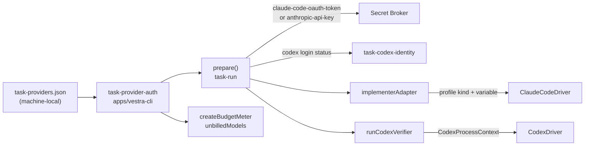

# Subscription Provider Authentication Design (ADP-A)

## Shape



No package edge changes. The Claude Code profile lives in `packages/drivers`,
the unbilled-usage rule in `packages/application`, the capsule field in
`packages/evidence`, and everything that knows the Workspace's mode in the
composition root `apps/vestra-cli`.

## Claude Code subscription profile (`packages/drivers`)

`ClaudeCodeMediatedProfile.kind` becomes `"mediated-mcp" |
"mediated-mcp-subscription"`. One table,
`CLAUDE_PROFILE_CREDENTIAL_VARIABLES`, names the single credential variable of
each kind; the composition reads it instead of spelling the variable again.

The subscription profile differs from `mediated-mcp` in five places. Everything
else (bridge tools, `0700` isolation directory, `0600` MCP configuration,
redaction, version floor, cancellation) is the same implementation.

1. **Arguments.** `buildSubscriptionArguments` is the mediated list without
   `--bare`, with `--include-hook-events` after `--include-partial-messages`
   and `--settings '{"disableAllHooks":true,"autoMemoryEnabled":false}'` before
   `--model`. The settings value is inline and constant, so the invocation
   stays fully pinned. Only two keys are passed because print mode ignores a
   settings value that fails validation as a whole; a wider value would risk
   losing `disableAllHooks` silently.
2. **Environment.** The allowlisted values, the per-run `HOME` and
   `CLAUDE_CONFIG_DIR`, exactly `CLAUDE_CODE_OAUTH_TOKEN`, and seven switches:
   `DISABLE_AUTOUPDATER`, `CLAUDE_CODE_DISABLE_NONESSENTIAL_TRAFFIC`,
   `CLAUDE_CODE_DISABLE_CLAUDE_MDS`, `CLAUDE_CODE_DISABLE_AUTO_MEMORY`,
   `CLAUDE_CODE_DISABLE_BACKGROUND_TASKS`,
   `CLAUDE_CODE_DISABLE_OFFICIAL_MARKETPLACE_AUTOINSTALL`, and
   `CLAUDE_CODE_DISABLE_TERMINAL_TITLE`, each set to `1`. The first two are the
   ones `mediated-mcp` already sets.
3. **Working directory.** The child runs in `<isolation>/workspace`, an empty
   directory created for the run. The model reaches the worktree only through
   the bridge, whose controller holds the worktree path, so Claude Code does
   not need the worktree as its working directory. Nothing the repository
   carries (`CLAUDE.md`, `AGENTS.md`, `.claude/`, `.mcp.json`) can then be
   discovered from the working directory, whatever a switch does or does not
   cover. The `mediation.cwd` value is still validated.
4. **Stream checks.** A launch carries a `surface`: `open` (T03), `bridge`
   (`mediated-mcp`: bridge tools only, bridge connected), or `bridge-only`
   (subscription: additionally exactly one MCP server, and no hook event).
   `streamEvent` parses a line and, for `bridge-only`, turns any `system`
   event whose subtype starts with `hook_` into
   `VES_CLAUDE_HOOK_UNEXPECTED`. With `--include-hook-events` every hook that
   runs is reported, so this is the detective control for a hook that
   `disableAllHooks` could not switch off.
5. **Managed policy.** Before the isolation directory is created,
   `refuseManagedPolicy` looks at the documented machine-wide locations:
   `/Library/Application Support/ClaudeCode` and the two managed-preference
   files of the `com.anthropic.claudecode` domain on macOS, `/etc/claude-code`
   on Linux. An existing file, a directory that is not empty, or a directory
   that cannot be listed refuses the launch. The profile option
   `managedPolicyPaths` replaces the list; the `mediated-mcp` profile rejects
   the option, and the composition never sets it.

`start` and its line handler keep their cyclomatic complexity: the profile
branch lives in `#mediatedLaunch`, `#subscriptionLaunch`, `surfaceOf`,
`streamEvent`, and `initEventFailure`.

## Codex subscription identity (`apps/vestra-cli/src/task/task-codex-identity.ts`)

- `codexIdentityDirectory(workspace)` is `<workspaceRoot>/codex-identity`.
- `ensureCodexIdentity` creates it with mode `0700`, refuses anything that is
  not a real directory, and rewrites `config.toml` with exactly:

  ```toml
  cli_auth_credentials_store = "file"
  forced_login_method = "chatgpt"
  ```

  The first line keeps the Codex credential in `auth.json` inside the
  directory and out of the OS credential store. The second makes an API-key
  login in that directory count as not logged in. Rewriting on every use means
  nothing a previous session left in `config.toml` carries over.
- `codexLoginStatus` runs `<codex> login status` with a bounded timeout, the
  pass-through environment, `CODEX_HOME` set to the identity directory, and a
  disposable `HOME` under the Workspace sessions root. It answers `chatgpt`
  only for exit code 0 with `Logged in using ChatGPT`; everything else is
  `not-configured`.
- `requireCodexSubscription` composes the two. On `not-configured` it writes
  one line to standard error with the exact command,
  `CODEX_HOME='<directory>' codex login`, and raises
  `VES_TASK_NOT_CONFIGURED` with requirement `codex-login`. The path is
  machine-local, so it goes to the terminal and never into the public error's
  safe details or any record.

`runCodexVerifier` takes either a credential (API-key mode, unchanged: a
per-session `CODEX_HOME` that is removed) or an identity directory
(subscription mode: `CODEX_HOME` is the identity directory, `HOME` is
per-session and removed, the execution carries no environment and no sensitive
value). `CodexDriver` and `CodexProcessContext` are unchanged.

## Mode selection (`apps/vestra-cli/src/task-provider-auth.ts`)

`task-providers.json` sits beside `task-gates.json` in the Workspace state
root and follows the same pattern: the user writes it, `vestra` reads it, and
no request can name it.

```json
{
  "schemaVersion": 1,
  "providers": {
    "claude-code": { "auth": "subscription" },
    "codex": { "auth": "api-key" }
  }
}
```

An absent file, or an absent provider, means `subscription`. An unknown key, a
wrong schema version, or an unknown mode is `VES_TASK_NOT_CONFIGURED` naming
`provider-auth`. The module reaches the state layout through the
`@verchestra/platform-node/secrets` subpath, which gains `resolveStateRoot` and
`resolveWorkspaceState`, so the doctor's credential check can use it without
loading the runtime store.

`prepare()` in `task-run.ts` loads the mode, reads only the credentials that
mode needs, finds both executables, and then proves the Codex login when the
verifier is on a subscription. All of it happens before the first transition.

## Budgets (`packages/application`, `packages/evidence`)

`createBudgetMeter` takes `unbilledModels`. Usage for a model in that list adds
tokens and a usage event, adds to a new ledger field `unbilledTokens`, adds no
cost, and skips the price lookup. Every other model keeps the priced path and
`VES_BUDGET_MODEL_UNKNOWN`. The cost ceiling therefore never trips for unbilled
usage, while the token and duration ceilings are unchanged.

The ledger's billing follows from `unbilledTokens`: none is `per-token`, all is
`subscription`, otherwise `mixed`. `task status` reports `consumedCostUsd` as
the text `not billed (subscription)` for `subscription`. The Run Capsule's
`budgetEvidence` gains an optional `billing` member (`subscription` or `mixed`)
and `consumed.unbilledTokens`; for `subscription` the `costUsd` member is
absent. A capsule without `billing` is read exactly as before.

The request intake still requires both models to have a priced entry
(GTC-04): the price table doubles as the list of supported models, and the
request does not know the mode.

## What the owner does once

1. `claude setup-token`, then pipe or type the token into
   `vestra secret set --name claude-code-oauth-token`.
2. Start a task once (or follow the quick-start): `vestra` creates the Codex
   identity directory, reports `codex-login` as not configured, and prints
   `CODEX_HOME='<directory>' codex login`. Run that command.
