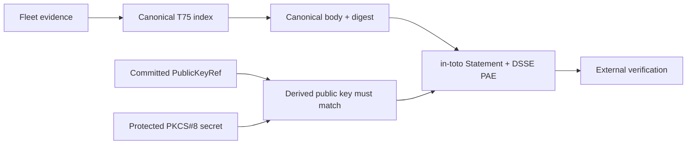

# T75 Qualification Evidence Signing Design

## Signed material

The canonical material is the evidence-index body: every field except
`bodyDigest` and `signingState`. `bodyDigest` is recomputed with canonical JSON
V2 before signing. The DSSE Statement subject names
`qualification-evidence-index` and carries that digest; its predicate content
is the same canonical body. This avoids a self-referential signature while
binding the candidate revision inside the signed predicate.

## Trust boundary

The signing command reads the private bytes once from its designated environment
variable, decodes them as PKCS#8 DER, and delegates Ed25519 validation to the
existing signer. It receives a public trust-reference path as input. It never
accepts a public key or an algorithm from the secret, never falls back to a
test key, and writes output only after all preconditions verify.

The workflow runs on a manually dispatched candidate. It checks out the exact
40-character revision, regenerates the canonical index from exactly five fleet
profile indexes, rejects contradictions, signs with the protected secret,
verifies the DSSE artifact with the committed reference, and uploads only
public evidence.

## Failure behavior

- Missing or malformed secret/reference: fail before output.
- Non-Ed25519 or non-PKCS#8 private material: fail.
- Derived public key, key id, purpose, or validity mismatch: fail.
- Index digest, revision, predicate, signature, or key identity mutation: fail.
- Any contradiction or inconsistent fleet record: fail before signing.
