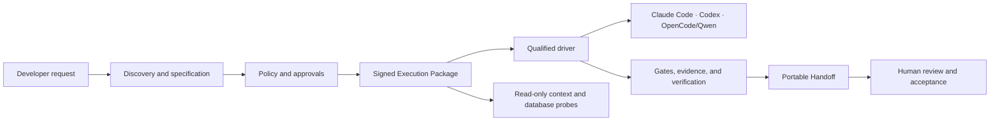
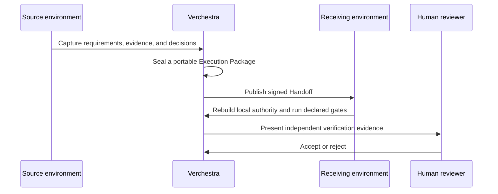

# Verchestra

[](https://github.com/accd/verchestra/actions/workflows/ci.yml)
[](https://accd.github.io/verchestra/)
[](LICENSE)
[](package.json)
[](ROADMAP.md)

**Verchestra es un entorno de entrega de software con IA verificado.** Convierte el descubrimiento, la planificación, la implementación, la validación y la aprobación humana en entregas portátiles, firmadas y revisables.

> **Estado actual:** `0.0.0-qualification` — desarrollo pre-1.0. El código fuente es público y la suite de cualificación está activa. Aún no hay un instalador público ni una versión de paquete disponible.

Explora el [sitio web del producto y la documentación buscable](https://accd.github.io/verchestra/), o continúa a continuación para ver el resumen del repositorio.

## Contribuciones listas para agentes y documentación legible por IA

Un clon limpio es autodescriptivo a través de los archivos `AGENTS.md` de nivel superior y con ámbito específico.
Ejecuta el comando de contexto sin dependencias antes de la instalación:

```bash
corepack pnpm agent:context -- --json
```

Consulta [Contribuir con agentes de código](docs/contributing-with-agents.md) para conocer la especificación neutral de proveedor, el flujo de trabajo de traspaso, seguridad, verificación y revisión humana.

La documentación legible por IA está disponible como el archivo [`llms.txt`](llms.txt) del repositorio, el [resumen para LLM](https://accd.github.io/verchestra/llms.txt) publicado, el [contexto completo con atribución](https://accd.github.io/verchestra/llms-full.txt) y alternativos en Markdown a nivel de página. Estas son ayudas para el momento de inferencia, no garantías de indexación, posicionamiento SEO, inclusión en entrenamiento o comportamiento de rastreadores.

## ¿Por qué Verchestra?

La entrega asistida por IA no debería depender de una sola máquina, un solo modelo o una conversación que no pueda revisarse. Verchestra mantiene el trabajo portátil y hace explícitas las decisiones críticas.

- **Ejecución portátil:** un Paquete de Ejecución firmado puede ser retomado por un entorno cualificado de Claude Code, Codex o OpenCode/Qwen.
- **Política antes de los efectos:** las capacidades, aprobaciones, concesiones y reglas de salida se verifican antes de generar efectos externos.
- **Descubrimiento de bases de datos de solo lectura:** Las sondas utilizan planes limitados, auditables y de solo lectura. SAP ASE / Sybase es un adaptador de primera clase.
- **Evidencia, no afirmaciones:** los paquetes, traspasos, informes y artefactos de lanzamiento vinculan su evidencia de origen mediante sumas de verificación (digest).
- **Control humano:** la verificación independiente y la revisión humana son estados explícitos del flujo de trabajo.
- **Repeticiones seguras:** los efectos duraderos, las operaciones de Git, la inicialización, la recuperación y la distribución están diseñados para converger de forma idempotente.

## Cómo se integra





## Áreas de cualificación soportadas

| Área                  | Alcance actual                                                                                                  |
| --------------------- | ---------------------------------------------------------------------------------------------------------------- |
| Controladores de IA  | Claude Code, Codex, OpenCode / Qwen                                                                              |
| Sondas de datos de solo lectura | PostgreSQL, MySQL / MariaDB, SQL Server, SAP ASE / Sybase, Oracle, SQLite, MongoDB                               |
| Espacios de trabajo   | Repositorios individuales, proyectos colocalizados, control centralizado de monorepo y proyectos anidados                       |
| Evidencia             | Paquetes firmados, cápsulas de ejecución, paquetes de recuperación, paquetes de soporte, procedencia e insumos de distribución respaldados por TUF |
| Gobernanza            | Políticas Cedar, aprobaciones, afirmaciones, concesiones, control de salida, verificación independiente y revisión humana                  |

## Inicio rápido para desarrolladores

Úsalo solo para trabajar en el árbol de código fuente. Aún no instala Verchestra en otro proyecto.

```bash
git clone https://github.com/accd/verchestra.git
cd verchestra
corepack enable
pnpm install --frozen-lockfile
pnpm gate:quick
```

Los requisitos son Node `24.14.0` y pnpm `10.34.5`.

## Alpha local cualificado: inicializar un espacio de trabajo

El alpha local actual expone solo `init`. Se ejecuta desde una copia del código fuente; no hay instalador público ni versión de producción. Desde la raíz de un repositorio Git desechable, invoca la CLI extraída con una identidad de espacio de trabajo portátil y explícita:

```bash
node /path/to/verchestra/apps/vestra-cli/bin/vestra.mjs init --dry-run \
  --workspace-id workspace_018f0b6d-7b1a-7abc-8def-0123456789ab \
  --name "My workspace" \
  --placement centralized \
  --output json
```

`--dry-run` es de solo lectura y devuelve el plan ordenado canónico. Revísalo y, luego, repite el comando sin `--dry-run` para aplicar los archivos del espacio de trabajo cualificado. Repetir la aplicación idéntica es una operación nula. `bootstrap`, `sync`, `workspace reconcile` y `doctor` no se anuncian intencionalmente aún.

### Desarrollo del sitio web

El sitio web es el paquete de espacio de trabajo privado `@verchestra/site`. Permanece estático, usa la ruta base `/verchestra/` y carga los documentos canónicos del repositorio en el momento de la compilación.

```bash
pnpm site:dev
pnpm site:check
pnpm site:test
pnpm site:build
pnpm site:preview
```

`pnpm site:test` ejecuta la integridad del contenido, diagnósticos de Astro, la compilación de producción, verificaciones de enlaces y metadatos, Playwright en Chromium, Firefox y WebKit, Axe y Lighthouse. Instala los navegadores de Playwright una vez con:

```bash
pnpm --filter @verchestra/site exec playwright install chromium firefox webkit
```

## Guía del repositorio

- [Sitio web y documentación del producto](https://accd.github.io/verchestra/) proporciona el portal público y buscable.
- [Guía de contribución para agentes](docs/contributing-with-agents.md) explica el contexto de clon limpio, traspaso portátil, seguridad y revisión.
- [Resumen legible por LLM](llms.txt) enlaza los recursos públicos deterministas legibles por IA.
- [Arquitectura](docs/architecture.md) explica los límites del sistema y el modelo de confianza.
- [Hoja de ruta](ROADMAP.md) muestra lo que está completo y lo que debe ocurrir antes de la versión 1.0.
- [Contribuir](CONTRIBUTING.md) explica cómo proponer cambios y ejecutar verificaciones.
- [Seguridad](SECURITY.md) explica la presentación responsable de vulnerabilidades.
- [Soporte](SUPPORT.md) dirige preguntas, ideas, errores e informes de seguridad al lugar adecuado.
- [Versionado](VERSIONING.md) explica la política de lanzamientos pre-1.0.

## Comunidad

Usa [GitHub Discussions](https://github.com/accd/verchestra/discussions) para preguntas y conversaciones sobre diseño. Usa GitHub Issues para errores reproducibles y propuestas de características con ámbito definido.

Por favor, lee el [Código de Conducta](CODE_OF_CONDUCT.md) antes de participar.

## Licencia

Verchestra está licenciado bajo la [Licencia Apache 2.0](LICENSE).
