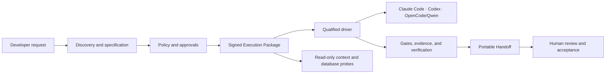
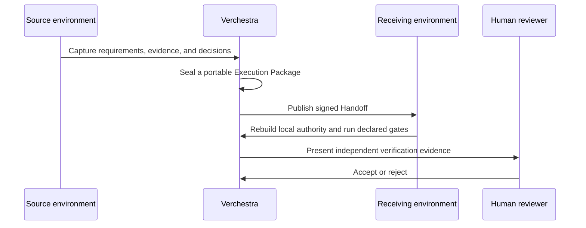

# Verchestra

<p align="center">
  <a href="https://accd.github.io/verchestra/">
    
  </a>
</p>

[](https://github.com/accd/verchestra/actions/workflows/ci.yml)
[](https://accd.github.io/verchestra/)
[](LICENSE)
[](package.json)
[](ROADMAP.md)

**Verchestra is a verified AI software-delivery harness.** It turns discovery, planning, implementation, validation, and human approval into portable, signed, and reviewable delivery work.

> **Current status:** `0.0.0-qualification` — pre-1.0 development. The source is public, the qualification suite is active, and `verchestra@0.0.0-qualification` is published on the public npm registry. That package installs the qualification build; it is not a production release and not 1.0.

Explore the [product website and searchable documentation](https://accd.github.io/verchestra/), or continue below for the repository overview.

## Agent-ready contribution and AI-readable docs

A clean clone is self-describing through the root and scoped `AGENTS.md` files.
Run the dependency-free context command before installation:

```bash
corepack pnpm agent:context -- --json
```

See [Contributing with Coding Agents](docs/contributing-with-agents.md) for the
provider-neutral specification, handoff, safety, verification, and human-review
workflow.

AI-readable documentation is available as the repository
[`llms.txt`](llms.txt), the published
[LLM summary](https://accd.github.io/verchestra/llms.txt), the
[full attributed context](https://accd.github.io/verchestra/llms-full.txt), and
page-level Markdown alternates. These are inference-time aids, not guarantees
of indexing, SEO ranking, training inclusion, or crawler behavior.

## Why Verchestra

AI-assisted delivery should not depend on one machine, one model, or an unreviewable conversation. Verchestra keeps the work portable and makes critical decisions explicit.

- **Portable execution:** a signed Execution Package can be resumed by a qualified Claude Code, Codex, or OpenCode/Qwen environment.
- **Policy before effects:** capabilities, approvals, leases, and egress rules are checked before external effects.
- **Read-only database discovery:** Probes use bounded, auditable, read-only plans. SAP ASE / Sybase is a first-class adapter.
- **Evidence, not assertions:** packages, handoffs, reports, and release artifacts bind their source evidence by digest.
- **Human control:** independent verification and human review are explicit workflow states.
- **Safe repeats:** durable effects, Git operations, initialization, recovery, and distribution are designed to converge idempotently.

## What works today

One honest matrix, mirrored from the typed status the website renders
(`apps/site/src/data/product.ts`) and checked by a drift test - the two
surfaces cannot disagree silently. **available** means runnable today from a
source checkout; **qualified** means backed by a public validation report but
not yet composed into the CLI; **planned** means roadmap work with a declared
task and no code claimed.

Rather than take the matrix's word for it, inspect
[a real, signed, fixture-generated Execution Package](docs/proof/execution-package.md) -
regenerable byte-for-byte from any clean clone with `corepack pnpm proof:generate`.

| Capability                                               | Status    | Reference            |
| -------------------------------------------------------- | --------- | -------------------- |
| Workspace initialization (init preview and apply)        | available | issue #64 slice A/B  |
| Evidence signing-key lifecycle (persist, rotate, revoke) | qualified | T68a                 |
| Cost and duration budget enforcement                     | qualified | T68b                 |
| Declared gate repair loop with human escalation          | qualified | T68c                 |
| Policy boundary: declarative tests and signed bundles    | qualified | T68d                 |
| AI driver adapters (Claude Code, Codex, OpenCode/Qwen)   | qualified | driver qualification |
| Read-only database probes (7 engines, fixture-qualified) | qualified | database matrix      |
| Signed distribution, activation, and rollback (TUF)      | qualified | T66-T68              |
| Self-Test trust domain and doctor --deep                 | qualified | T69-T72              |
| Public regression campaigns and sealed-holdout promotion | qualified | T73-T74              |
| Platform matrix, release candidate, and the 1.0 decision | planned   | T75-T77              |

Full reports live under [docs/qualification/](docs/qualification/) and on the
[public evidence pages](https://accd.github.io/verchestra/docs/qualification/).

## What Verchestra is not

- It is not a public production release - the published npm package installs `0.0.0-qualification`, not 1.0.
- It is not a hosted service - everything runs on your own machine.
- It does not transfer provider credentials - a handoff carries evidence and next actions, never sessions or secrets.
- It does not make unapproved paid model calls - a missing provider reports `not configured`, never a silent pass.
- It does not treat CI as human review - acceptance is an explicit human decision recorded as evidence.
- It does not call same-author checks independent verification - that distinction is stated, not blurred.
- It does not expose unqualified commands - the installed CLI advertises `init`, `self-test`, and `doctor` and nothing else.

## How it fits together



The sequence below is the target workflow the chain above qualifies toward;
the pieces marked `qualified` in the matrix exist and are evidence-backed, and
`init` is the part composed into the CLI today.



## Supported qualification surface

| Area                  | Current surface                                                                                                  |
| --------------------- | ---------------------------------------------------------------------------------------------------------------- |
| AI drivers            | Claude Code, Codex, OpenCode / Qwen                                                                              |
| Read-only data probes | SQLite (live-qualified), MongoDB, MySQL / MariaDB, Oracle, PostgreSQL, SAP ASE / Sybase, SQL Server              |
| Workspaces            | Single repositories, colocated projects, centralized monorepo control, and nested projects                       |
| Evidence              | Signed packages, run capsules, recovery bundles, support bundles, provenance, and TUF-backed distribution inputs |
| Governance            | Cedar policy, approvals, claims, leases, egress control, independent verification, human review                  |

## Install and run

Verchestra is published as one npm package. Installing it needs no clone, no
build, no credential, and no configuration.

```bash
npx verchestra --help
```

The package provides two equivalent binaries, `verchestra` and `vestra`.

The first run does the real work: it reads the trust root pinned inside the
package, resolves the pinned release through TUF, verifies every component byte,
activates the release transactionally behind a health gate, and hands control to
the activated release's own launcher. Your ambient Node runs the bootstrap and
nothing else — the activated release carries its own Node runtime, so Node is
not a prerequisite beyond what `npx` itself needs. Expect a couple of minutes on
a cold first run and a few seconds once a release is activated.

One prerequisite is not bundled: a `git` binary must be on `PATH`, because the
Self-Test profiles provision their fixtures by invoking `git`
(`packages/self-test/src/git-fixtures.ts`).

### Portability demonstration

```bash
npx verchestra self-test --profile smoke
```

A `self_test.verdict: PASS` with an empty `self_test.failure_codes` means this
machine resolved and verified a signed release, activated it, and ran the
packaged Self-Test profile inside a disposable, isolated trust domain — with no
repository checkout anywhere in the journey.

> **Known limitation.** `self-test` currently refuses when the working directory
> is an ancestor of the operating system's temporary directory. On Windows the
> default home directory is such an ancestor, so a shell opened at its default
> location fails with `VES_CLI_COMMAND_FAILED`. Run the command from a project
> directory until the fix ships. Tracked as
> [issue #370](https://github.com/accd/verchestra/issues/370).

### Managed state, recovery, and cleanup

The launcher keeps its staged releases, its activated install, its trust anchor,
and the active-release pointer under one machine-local state root. Nothing of
yours is stored there.

| Platform | Managed state root                                |
| -------- | ------------------------------------------------- |
| Windows  | `%LOCALAPPDATA%\Verchestra\state`                 |
| macOS    | `~/Library/Application Support/Verchestra/state`  |
| Linux    | `~/.local/state/verchestra`                       |

The launcher derives that location from your home directory and the platform
alone; it deliberately reads no environment variable, so redirecting
`LOCALAPPDATA` or `XDG_STATE_HOME` does not move it and cannot be used to
redirect a trust root or a release.

To recover from a failed run, run the command again: activation is transactional
and converges. If activation keeps failing, delete the managed state root and run
the command again — the next run resolves and activates from scratch.

To remove Verchestra completely, delete the managed state root and clear the
downloaded package with `npm cache clean --force`. The two are independent, and
neither touches your own workspace data.

## Developer quick start

Use this only to work on the source tree. To run Verchestra, use `npx verchestra`
above.

```bash
git clone https://github.com/accd/verchestra.git
cd verchestra
corepack enable
pnpm install --frozen-lockfile
pnpm gate:quick
```

Requirements are Node `24.14.0` and pnpm `10.34.5`.

## Qualified local alpha: initialize a workspace

`init` is the qualified workspace command. Run it through `npx verchestra init`,
or, when you are working on the source tree, invoke the checked-out CLI
directly. From the root of a disposable Git repository, pass an explicit,
portable workspace identity:

```bash
node /path/to/verchestra/apps/vestra-cli/bin/vestra.mjs init --dry-run \
  --workspace-id workspace_018f0b6d-7b1a-7abc-8def-0123456789ab \
  --name "My workspace" \
  --placement centralized \
  --output json
```

`--dry-run` is read-only and returns the canonical ordered plan. Review it,
then repeat the command without `--dry-run` to apply the qualified workspace
files. Repeating the identical apply is a no-op. `bootstrap`, `sync`, and
`workspace reconcile` are intentionally not advertised yet.

### Website development

The website is the private `@verchestra/site` workspace package. It remains static, uses the `/verchestra/` base path, and loads canonical repository documents at build time.

```bash
pnpm site:dev
pnpm site:check
pnpm site:test
pnpm site:build
pnpm site:preview
```

`pnpm site:test` runs content integrity, Astro diagnostics, the production build, link and metadata checks, Playwright across Chromium, Firefox, and WebKit, Axe, and Lighthouse. Install the Playwright browsers once with:

```bash
pnpm --filter @verchestra/site exec playwright install chromium firefox webkit
```

## Repository guide

- [Product website and documentation](https://accd.github.io/verchestra/) provides the public, searchable portal.
- [Agent contribution guide](docs/contributing-with-agents.md) explains clean-clone context, portable handoff, safety, and review.
- [LLM-readable summary](llms.txt) links the deterministic public AI-readable resources.
- [Architecture](docs/architecture.md) explains the system boundaries and trust model.
- [Roadmap](ROADMAP.md) shows what is complete and what must happen before 1.0.
- [Contributing](CONTRIBUTING.md) explains how to propose changes and run checks.
- [Security](SECURITY.md) explains responsible vulnerability reporting.
- [Support](SUPPORT.md) directs questions, ideas, bugs, and security reports to the right place.
- [Versioning](VERSIONING.md) explains the pre-1.0 release policy.

## Community

Use [GitHub Discussions](https://github.com/accd/verchestra/discussions) for questions and design conversations. Use GitHub Issues for reproducible bugs and scoped feature proposals.

Please read the [Code of Conduct](CODE_OF_CONDUCT.md) before participating.

## License

Verchestra is licensed under the [Apache License 2.0](LICENSE).
