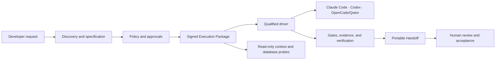
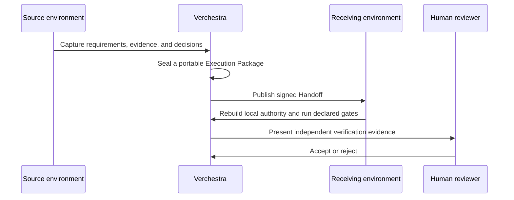

# Verchestra

[](https://github.com/accd/verchestra/actions/workflows/ci.yml)
[](https://accd.github.io/verchestra/)
[](LICENSE)
[](package.json)
[](ROADMAP.md)

**Verchestra is a verified AI software-delivery harness.** It turns discovery, planning, implementation, validation, and human approval into portable, signed, and reviewable delivery work.

> **Current status:** `0.0.0-qualification` — pre-1.0 development. The source is public and the qualification suite is active. A public installer and package release are not available yet.

Explore the [product website and searchable documentation](https://accd.github.io/verchestra/), or continue below for the repository overview.

## Agent-ready contribution and AI-readable docs

A clean clone is self-describing through the root and scoped `AGENTS.md` files.
Run the dependency-free context command before installation:

```bash
corepack pnpm agent:context -- --json
```

See [Contributing with Coding Agents](docs/contributing-with-agents.md) for the
provider-neutral specification, handoff, safety, verification, and human-review
workflow.

AI-readable documentation is available as the repository
[`llms.txt`](llms.txt), the published
[LLM summary](https://accd.github.io/verchestra/llms.txt), the
[full attributed context](https://accd.github.io/verchestra/llms-full.txt), and
page-level Markdown alternates. These are inference-time aids, not guarantees
of indexing, SEO ranking, training inclusion, or crawler behavior.

## Why Verchestra

AI-assisted delivery should not depend on one machine, one model, or an unreviewable conversation. Verchestra keeps the work portable and makes critical decisions explicit.

- **Portable execution:** a signed Execution Package can be resumed by a qualified Claude Code, Codex, or OpenCode/Qwen environment.
- **Policy before effects:** capabilities, approvals, leases, and egress rules are checked before external effects.
- **Read-only database discovery:** Probes use bounded, auditable, read-only plans. SAP ASE / Sybase is a first-class adapter.
- **Evidence, not assertions:** packages, handoffs, reports, and release artifacts bind their source evidence by digest.
- **Human control:** independent verification and human review are explicit workflow states.
- **Safe repeats:** durable effects, Git operations, initialization, recovery, and distribution are designed to converge idempotently.

## How it fits together





## Supported qualification surface

| Area                  | Current surface                                                                                                  |
| --------------------- | ---------------------------------------------------------------------------------------------------------------- |
| AI drivers            | Claude Code, Codex, OpenCode / Qwen                                                                              |
| Read-only data probes | PostgreSQL, MySQL / MariaDB, SQL Server, SAP ASE / Sybase, Oracle, SQLite, MongoDB                               |
| Workspaces            | Single repositories, colocated projects, centralized monorepo control, and nested projects                       |
| Evidence              | Signed packages, run capsules, recovery bundles, support bundles, provenance, and TUF-backed distribution inputs |
| Governance            | Cedar policy, approvals, claims, leases, egress control, independent verification, human review                  |

## Developer quick start

Use this only to work on the source tree. It does not install Verchestra into another project yet.

```bash
git clone https://github.com/accd/verchestra.git
cd verchestra
corepack enable
pnpm install --frozen-lockfile
pnpm gate:quick
```

Requirements are Node `24.14.0` and pnpm `10.34.5`.

### Website development

The website is the private `@verchestra/site` workspace package. It remains static, uses the `/verchestra/` base path, and loads canonical repository documents at build time.

```bash
pnpm site:dev
pnpm site:check
pnpm site:test
pnpm site:build
pnpm site:preview
```

`pnpm site:test` runs content integrity, Astro diagnostics, the production build, link and metadata checks, Playwright across Chromium, Firefox, and WebKit, Axe, and Lighthouse. Install the Playwright browsers once with:

```bash
pnpm --filter @verchestra/site exec playwright install chromium firefox webkit
```

## Repository guide

- [Product website and documentation](https://accd.github.io/verchestra/) provides the public, searchable portal.
- [Agent contribution guide](docs/contributing-with-agents.md) explains clean-clone context, portable handoff, safety, and review.
- [LLM-readable summary](llms.txt) links the deterministic public AI-readable resources.
- [Architecture](docs/architecture.md) explains the system boundaries and trust model.
- [Roadmap](ROADMAP.md) shows what is complete and what must happen before 1.0.
- [Contributing](CONTRIBUTING.md) explains how to propose changes and run checks.
- [Security](SECURITY.md) explains responsible vulnerability reporting.
- [Support](SUPPORT.md) directs questions, ideas, bugs, and security reports to the right place.
- [Versioning](VERSIONING.md) explains the pre-1.0 release policy.

## Community

Use [GitHub Discussions](https://github.com/accd/verchestra/discussions) for questions and design conversations. Use GitHub Issues for reproducible bugs and scoped feature proposals.

Please read the [Code of Conduct](CODE_OF_CONDUCT.md) before participating.

## License

Verchestra is licensed under the [Apache License 2.0](LICENSE).
