# Roadmap

Verchestra is in `0.0.0-qualification`. The roadmap is intentionally evidence-driven: a stage is complete only when its required tests and qualification evidence pass.

## Completed foundation

The repository has qualified the foundations through **T68**:

- Runtime, Pi, Claude Code, Codex, OpenCode/Qwen, Cedar, SQLite, isolation, and update-key primitives
- Core schemas, integrity, workflow state, durable effects, local state, workspace placement, and safe initialization
- Policy, approval, lease, trust, egress, context, model routing, driver, skill, and discovery boundaries
- Read-only probes for PostgreSQL, MySQL/MariaDB, SQL Server, SAP ASE/Sybase, Oracle, SQLite, and MongoDB
- Hybrid memory, portable Execution Packages, Run Capsules, Recovery Bundles, Support Bundles, gates, verification, handoff, Jira, and Confluence
- Cross-backend delivery proof, hermetic distribution bundles, TUF resolution, transactional activation, rollback, and uninstall safety

## Path to 1.0

```mermaid
flowchart LR
  T68["T68 Activation and rollback ✓"] --> T69["T69 Self-Test trust domain"]
  T69 --> T70["T70 Smoke and workspace profiles"]
  T70 --> T71["T71 Full, fault, and driver profiles"]
  T71 --> T72["T72 Deep doctor and signed reports"]
  T72 --> T73["T73 Public regression campaigns"]
  T73 --> T74["T74 Sealed holdout promotion gate"]
  T74 --> T75["T75 Platform and security qualification"]
  T75 --> T76["T76 Verified release candidate"]
  T76 --> T77["T77 Independent acceptance and 1.0 decision"]
```

### Release conditions

Version `1.0.0` is promoted only when all acceptance requirements are mapped to evidence, all required gates pass, no required fault survives independent verification, and human operational and security reviewers sign the decision.

The authoritative implementation backlog is maintained in [GitHub Issues](https://github.com/accd/verchestra/issues).
