# Roadmap

Verchestra is in `0.0.0-qualification`. The roadmap is intentionally evidence-driven: a stage is complete only when its required tests and qualification evidence pass.

## Completed foundation

The repository has qualified the foundations through **T68**:

- Runtime, Pi, Claude Code, Codex, OpenCode/Qwen, Cedar, SQLite, isolation, and update-key primitives
- Core schemas, integrity, workflow state, durable effects, local state, workspace placement, and safe initialization
- Policy, approval, lease, trust, egress, context, model routing, driver, skill, and discovery boundaries
- Read-only probes for PostgreSQL, MySQL/MariaDB, SQL Server, SAP ASE/Sybase, Oracle, SQLite, and MongoDB
- Hybrid memory, portable Execution Packages, Run Capsules, Recovery Bundles, Support Bundles, gates, verification, handoff, Jira, and Confluence
- Cross-backend delivery proof, hermetic distribution bundles, TUF resolution, transactional activation, rollback, and uninstall safety

## Path to 1.0

```mermaid
flowchart LR
  T68["T68 Activation and rollback ✓"] --> T68a["T68a Key lifecycle and portability proof"]
  T68a --> T68b["T68b Budget enforcement"]
  T68b --> T68c["T68c Declarative gate repair"]
  T68c --> T68d["T68d Policy hardening"]
  T68d --> T69["T69 Self-Test trust domain"]
  T69 --> T70["T70 Smoke and workspace profiles"]
  T70 --> T71["T71 Full, fault, and driver profiles"]
  T71 --> T72["T72 Deep doctor and signed reports"]
  T72 --> T73["T73 Public regression campaigns"]
  T73 --> T74["T74 Sealed holdout promotion gate"]
  T74 --> T75["T75 Platform and security qualification"]
  T75 --> T76["T76 Verified release candidate"]
  T76 --> T77["T77 Independent acceptance and 1.0 decision"]
```

### Release conditions

Version `1.0.0` is promoted only when all acceptance requirements are mapped to evidence, all required gates pass, no required fault survives independent verification, and human operational and security reviewers sign the decision.

The authoritative implementation backlog is maintained in [GitHub Issues](https://github.com/accd/verchestra/issues).

## Inserted hardening tasks (T68a–T68d)

Inserted by human decision on 2026-07-26 after the verified external review
triage in `.specs/features/external-review-triage/`. Existing T01–T68
evidence and the T69–T77 numbering are unchanged, preserving qualification
traceability. Each inserted task has a tracked specification:

- **T68a Key lifecycle and portability proof** — `.specs/features/key-lifecycle/`
- **T68b Budget enforcement** — `.specs/features/budget-enforcement/`
- **T68c Declarative gate repair** — `.specs/features/gate-repair-loop/`
- **T68d Policy hardening** — `.specs/features/policy-hardening/`

Two further review outcomes carry mandatory decisions before T76: the DSSE +
in-toto signature envelope (`.specs/features/dsse-attestation/`) and real
context tokenizers (`.specs/features/context-tokenizers/`).

Derived status surfaces (`agent:context`, root instructions, `llms.txt`,
and the public site) report whatever the qualification resolver derives from
the chain above and the reports on disk; they carry no hand-maintained task
pair. (Historical note, 2026-07-26: until the first inserted task completed,
those surfaces read "T68 complete; T69 next", and migrating them was executed
as part of starting T68a.)

## Independent repository-readiness stream

Agent-ready repository instructions, portable contribution handoffs,
provider-neutral evaluation, and LLM-readable documentation are maintenance
work independent of the product task chain. They do not advance product
qualification: T68 remains complete and the inserted T68a–T68d chain
precedes T69.
