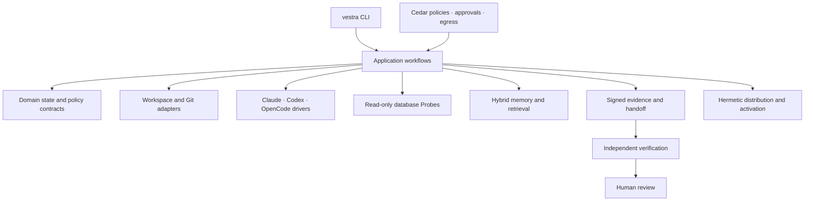

# Architecture

Verchestra is a delivery control plane, not a model wrapper. It separates portable delivery facts from machine-local credentials, sessions, and provider state.

## Trust model

The core rule is simple: portable artifacts carry only the information required to reproduce and verify delivery work. Credentials, provider sessions, tokens, raw local paths, and machine-local profiles stay outside shared artifacts.

An Execution Package closes requirements, decisions, tasks, source-bound evidence, context references, approvals, budget, and completion criteria under content digests and signatures. A receiving environment must rebuild its own local authority before continuing work.

## Workflow

1. **Discover** repository, documentation, issue-tracker, and approved read-only data context.
2. **Specify and plan** the work with explicit requirements, gates, and human decisions.
3. **Seal** a portable Execution Package and, when needed, publish a signed Handoff.
4. **Execute** through a qualified driver within approved policy and capability boundaries.
5. **Verify** outcomes independently, collect evidence, and stop for human review when required.
6. **Recover or transfer** work through durable checkpoints, Capsules, Recovery Bundles, and Handoffs.

## Main boundaries

| Boundary | Responsibility |
| --- | --- |
| Workspace | Detect topology, plan safe placement, initialize tracked project artifacts, and isolate local state |
| Policy | Evaluate Cedar rules, approvals, claims, leases, and exact egress permissions before effects |
| Drivers | Normalize Claude Code, Codex, and OpenCode/Qwen behind a bounded protocol |
| Data Probes | Plan bounded, audited, read-only metadata and query operations across supported databases |
| Memory | Store and retrieve promoted, source-bound knowledge with hybrid text and vector search |
| Evidence | Seal packages, capsules, recovery/support artifacts, and verification evidence with digests and signatures |
| Distribution | Build hermetic bundles, resolve TUF metadata, activate transactionally, recover safely, and roll back |

## Repository placement

Shared project artifacts live in `.verchestra/` and are designed to be committed when the workspace policy allows it. Machine-local state is deliberately separated into ignored `.verchestra` subtrees or an operating-system local state root. This preserves team reproducibility without leaking credentials or one developer's model setup.

## Safety principles

- Default to read-only discovery and explicit approval for effects.
- Bind evidence to exact source and policy state.
- Fail closed when identity, integrity, scope, or authority is unclear.
- Prefer idempotent reconciliation over blind retry.
- Keep independent verification separate from implementation.
- Require human acceptance for the workflow states that change accountability.
